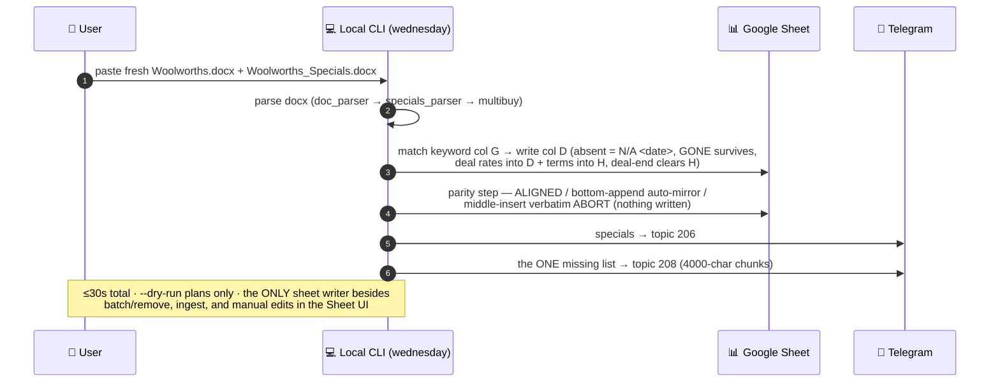

# AI Development Environment — Project README

> **This folder (`grocery-price-tracker/`) is the ultimate canonical root for the entire project.** All project code should live here going forward. Any code currently living outside this folder (in the parent `AI related/` directory) is documented in [Code Currently Outside This Folder (Pending Migration)](#code-currently-outside-this-folder-pending-migration) and will be migrated into this folder later.

A unified, personal AI development environment built around **OpenClaw** ("Claw") — a Telegram-native AI assistant running on a VPS. Claw orchestrates a collection of Python tools (grocery price tracking, expense analysis, LLM pricing, web scraping, image generation, and more) that are exposed as OpenClaw *skills* and invoked conversationally via Telegram, the web UI, or the CLI.

The local machine (Windows + Anaconda) is the development workspace; the VPS (Docker) is the production runtime.

---

## Table of Contents

1. [What's Inside This Folder](#whats-inside-this-folder)
2. [Architecture at a Glance](#architecture-at-a-glance)
3. [Environments — Local, VPS, GitHub](#environments--local-vps-github)
4. [The OpenClaw Runtime (VPS)](#the-openclaw-runtime-vps)
5. [Grocery Price Tracker (flagship tool)](#grocery-price-tracker-flagship-tool)
6. [Telegram Gateway](#telegram-gateway)
7. [Claw Skills](#claw-skills)
8. [Other Tools](#other-tools)
9. [Code Currently Outside This Folder (Pending Migration)](#code-currently-outside-this-folder-pending-migration)
10. [Secrets & Environment Variables](#secrets--environment-variables)
11. [Common Workflows](#common-workflows)
12. [Quick Commands](#quick-commands)
13. [Project Conventions](#project-conventions)

---

## What's Inside This Folder

```
grocery-price-tracker/                      ← ULTIMATE PROJECT ROOT (this folder)
├── README.md                              ← this file
├── PROJECT-MAP.md                         ← plain-language map of every list/command/flow (update with every change)
├── architecture-spec.md                   ← architecture spec (v2, IMPLEMENTED + CLOSED)
├── old md/2026-09-v2-rebuild/             ← archived rebuild artifacts (work orders, plans, round logs)
├── __init__.py                            ← package marker
├── app.py                                 ← Streamlit app (legacy UI, mostly superseded by headless CLI)
├── local_sync.py                           ← legacy rapidfuzz-based sync (superseded by lookup engine)
├── name_importer.py                        ← saved-list name import helper
├── Woolworths_Historical.py                ← historical Woolworths price export
├── requirements.txt                        ← Python deps (gspread, google-auth, python-docx, curl_cffi, etc.)
├── runtime.txt                             ← runtime version pin
├── packages.txt                            ← system packages
├── LICENSE
├── .gitignore
├── .git/                                   ← nested git repo (Phase 9 work)
├── .pytest_cache/  .streamlit/             ← caches (gitignored)
│
├── core/                                   ← core library (v2_read/v2_live/v2_batch/v2_wednesday, local_deals, halal, subcategory, discounts)
├── extractors/                             ← Woolworths/Coles live extractors + doc/specials parsers + FB fetchers
├── components/                             ← (reserved, currently empty)
├── data/                                   ← runtime state (inbox, scan state, post log, ignored items)
├── tests/                                  ← 605 tests (read path, twin line, batch, parity, wednesday, local deals, discounts)
│
├── Aldi.docx  Coles.docx  Woolworths.docx ← saved-list source files (pasted by user, parsed by doc_parser)
├── Woolworths_Specials.docx                ← specials source file
├── woolworths_master_comparison.csv        ← master comparison export
├── credentials.json                        ← local Google service-account (gitignored; VPS uses env var)
├── prompt to add woolworths savings button.txt
└── Telegram Commands.txt
```

---

## Architecture at a Glance

```
┌──────────────────────────────────────────────────────────────────┐
│  USER                                                             │
│  Telegram app ──── DMs @ClawArkindBot (chat 1594431983)            │
│                   Web UI (https://169-58-107-0.sslip.io)          │
│                   CLI (openclaw agent / openclaw message)         │
└──────────────────────────┬───────────────────────────────────────┘
                           │ Telegram long-poll (getUpdates)
                           ▼
┌──────────────────────────────────────────────────────────────────┐
│  VPS  169.58.107.0  (Ubuntu)   SSH alias: myvps                   │
│  ┌─────────────────────────────────────────────────────────────┐ │
│  │  Docker container: openclaw-core  (image openclaw-core:sketch)│ │
│  │  OpenClaw gateway 2026.6.34  (Node, /app/openclaw.mjs)       │ │
│  │   ├─ Telegram channel (@ClawArkindBot)                      │ │
│  │   ├─ Agent model: glm-5.3-flash             │ │
│  │   ├─ Control API: port 18789 (in-container)                 │ │
│  │   └─ Skills loaded from /app/tasks/ai-tools/claw-skills/   │ │
│  │       (bind-mount ← /home/ubuntu/openclaw/tasks/ai-tools/)  │ │
│  └─────────────────────────────────────────────────────────────┘ │
│  ┌─────────────────────────────────────────────────────────────┐ │
│  │  Docker: ai-studio-app (Next.js) + ai-studio-db (Postgres 16)│ │
│  └─────────────────────────────────────────────────────────────┘ │
│  cron: 03:17 sheet_backup.py (canary) + hourly local-deals scan  │
└──────────────────────────┬───────────────────────────────────────┘
                           │ scp / tar sync (NOT git pull — branches diverged)
                           ▼
┌──────────────────────────────────────────────────────────────────┐
│  LOCAL  Windows + Anaconda Python                                 │
│  C:\Users\User.DESKTOP-R2G441H\Documents\AI related\             │
│   └── grocery-price-tracker\   ← THIS FOLDER (ultimate root)     │
│       (parent "AI related" also holds sibling tools — see below)  │
└──────────────────────────┬───────────────────────────────────────┘
                           │ git push
                           ▼
┌──────────────────────────────────────────────────────────────────┐
│  GITHUB  arkind13/AI-Development-Environment  (private)         │
│  main = local dev HEAD.  master = VPS HEAD (diverged).           │
└──────────────────────────────────────────────────────────────────┘
```

### How everything works — visual map (v2, 2026-09-10)

```mermaid
flowchart TB
    USER["👤 User<br/>Telegram DM · Web UI · openclaw CLI"]

    subgraph TG["💬 Telegram — Claw Command Center (supergroup)"]
        direction TB
        DM["📩 User DM<br/>lookup / live / batch replies"]
        WEEKLY["📋 weekly-lists — 208<br/>the ONE missing list (Wednesday)"]
        SPECIALS["🏷️ specials-wool — 206<br/>Woolworths specials report"]
    end

    subgraph VPS["🖥️ VPS 169.58.107.0 — docker: openclaw-core"]
        CLAW["🤖 Claw agent (OpenClaw)<br/>grocery-price skill — ALL price questions<br/>route to the CLI (no pre-investigation)"]
        CRON["⏰ cron: 03:17 sheet_backup canary<br/>+ hourly local-deals daily-scan"]
    end

    subgraph LOCAL["💻 Local Windows machine (Anaconda)"]
        CLI["🛒 grocery_price_cli.py — 8 verbs<br/>price · list · live · batch · ignored<br/>specials · local-deals · wednesday"]
        subgraph CORE["core/ — brain"]
            READ["v2_read.py<br/>lookup + ONE list + 🏆<br/>non-halal twin line"]
            LIVE["v2_live.py<br/>WW + Coles web search<br/>prices only"]
            BATCH["v2_batch.py<br/>done/gone/rename/remove/ignore"]
            WED["v2_wednesday.py<br/>docx → col D/G/H sync<br/>parity → 2 posts"]
            LD["local_deals.py<br/>4 shops · permanent+special<br/>ingest · sweep · codes"]
            HALAL["halal.py · subcategory.py<br/>meat gate · never guess"]
            DISC["woolworths_discounts.py<br/>5% + home-brand 5%<br/>(display-only)"]
        end
        subgraph EXT["extractors/ + tools/"]
            DOCP["doc_parser · specials_parser<br/>multibuy — the docx chain"]
            FB["fb_flyer_fetch · flyer_vision<br/>shop_site_catalogue"]
            TOOLS["migrate_v2 audit · parity_audit<br/>sheet_backup"]
        end
        DATA["🗂️ data/ — runtime state<br/>local_deals_inbox/ · scan state<br/>post log · ignored_items.txt"]
    end

    SHEET["📊 Google Sheet — THE source of truth<br/>Products_Master 13 cols (A name · D WW price · G keyword · H specials · L code)<br/>Local_Deals 11 cols (permanent+special per shop · K code)<br/>parity: every master row mirrors by Item_Code"]
    STORES["🏬 woolworths.com.au · coles.com.au<br/>(live verb only)"]
    GH["🐙 GitHub — arkind13/grocery-price-tracker + parent repo"]

    USER -->|"asks in chat"| CLAW
    CLAW -->|"skill → CLI (in container)"| DM
    CRON -->|"backup fails = page"| DM
    CLI --> READ
    CLI --> LIVE
    CLI --> BATCH
    CLI --> WED
    CLI --> LD
    DISC --> READ
    READ <-->|"read + [CODE] replies"| SHEET
    WED <-->|"col D/G/H writes + parity"| SHEET
    LD <-->|"ingest / sweep / set-*"| SHEET
    WED -->|"specials → 206"| SPECIALS
    WED -->|"ONE list → 208"| WEEKLY
    LIVE -->|"prices only"| STORES
    FB -->|"vision parse"| LD
    LOCAL -.->|"git push + scp mirror"| GH

    classDef vps fill:#e8f0fe,stroke:#1a73e8,color:#202124
    classDef local fill:#fef7e0,stroke:#f9ab00,color:#202124
    classDef tg fill:#e6f4ea,stroke:#34a853,color:#202124
    classDef cloud fill:#f3e8fd,stroke:#a142f4,color:#202124
    classDef store fill:#fce8e6,stroke:#d93025,color:#202124
    class CLAW,CRON vps
    class CLI,READ,LIVE,BATCH,WED,LD,HALAL,DISC,DOCP,FB,TOOLS,DATA local
    class DM,WEEKLY,SPECIALS tg
    class SHEET,GH cloud
    class STORES store
```



And the Wednesday rhythm — the ONE weekly write path:



---

## Environments — Local, VPS, GitHub

### 1. Local Windows Machine (Development)

**Parent dir:** `C:\Users\User.DESKTOP-R2G441H\Documents\AI related\`
**This folder (ultimate root):** `...\AI related\grocery-price-tracker\`

Anaconda Python (`anaconda3\python.exe`) is the default interpreter. The local `.env` (in the parent dir) holds all secrets and is gitignored — never committed.

> **Note on layout:** The parent `AI related\` directory currently mirrors the VPS `tasks/ai-tools/` layout (the CLI entrypoint `grocery_price_cli.py`, `claw-skills/`, `telegram_gateway/`, and all sibling tools live as siblings of this folder). The plan is to migrate all of those into this `grocery-price-tracker/` folder so it becomes the single root. See [Code Currently Outside This Folder](#code-currently-outside-this-folder-pending-migration).

### 2. VPS (Production Runtime)

**Host:** `ubuntu@169.58.107.0` (SSH alias: `myvps`)
**Root:** `/home/ubuntu/openclaw/`

The VPS runs the OpenClaw gateway inside a Docker container (`openclaw-core`). The container's `/app/tasks` is a **live bind-mount** of the host's `/home/ubuntu/openclaw/tasks/ai-tools/` — so any file synced to the host repo is immediately visible inside the container (no rebuild needed, survives container restarts).

```
/home/ubuntu/openclaw/
├── openclaw.json                 — gateway config (providers, telegram, skills, tools)
├── docker-compose.yml             — openclaw-core service definition
├── Dockerfile.claw-render         — render image (Playwright + Chromium)
├── .env  → /home/ubuntu/.env      — secrets symlink (all env vars live here)
├── NEW_GATEWAY_TOKEN.txt          — gateway control-API token
├── pylibs/                        — Python packages (PYTHONPATH=/app/pylibs, Python 3.11)
├── pip-bootstrap/                 — minimal Python 3.12 venv
├── scp_staging/                   — deployment staging artifacts
├── tasks/
│   ├── ai-tools/                  — ← MIRRORS LOCAL "AI related" ROOT
│   │   ├── grocery_price_cli.py
│   │   ├── grocery-price-tracker/   ← THIS FOLDER (on VPS)
│   │   ├── claw-skills/
│   │   ├── telegram_gateway/
│   │   └── (all sibling tools)
│   ├── aistudio/                  — AI Studio task metadata
│   └── diag*.sh                   — diagnostic scripts
└── scripts/  (sibling, NOT in git — scp'd directly)
    ├── wednesday_reminder.py      — cron-fired grocery-sync reminder sender
    ├── .wednesday_reminder_state.json — idempotency state
    └── wednesday_reminder.log     — cron stdout/stderr
```

**Bind mounts (container → host):**

| Container path | Host path | Mode |
|----------------|-----------|------|
| `/app/tasks` | `/home/ubuntu/openclaw/tasks` | rw (live) |
| `/app/openclaw.json` | `/home/ubuntu/openclaw/openclaw.json` | rw |
| `/home/node/.openclaw/openclaw.json` | `/home/ubuntu/openclaw/openclaw.json` | rw |
| `/app/pylibs` | `/home/ubuntu/openclaw/pylibs` | ro |

> **Package installs must go into `pylibs`, never the container layer.**
> Anything `pip install`ed inside the running container is wiped by the
> next `--force-recreate` (this silently broke Woolworths live search on
> 2026-09-01: curl_cffi lived only in the container layer). Durable
> install (matches container Python 3.11, survives recreates):
>
> ```bash
> ssh myvps "docker run --rm -v /home/ubuntu/openclaw/pylibs:/target \
>   python:3.11-slim pip install --no-deps --target /target <pkg>"
> ```
>
> curl_cffi 0.16.1 is installed this way (Woolworths no-auth search).
| `/app/tasks/ai-tools/.env` | `/home/ubuntu/openclaw/.env` | ro |

### 3. GitHub

**Repo:** `arkind13/AI-Development-Environment` (private)
**URL:** `https://github.com/arkind13/AI-Development-Environment.git` (VPS uses `git@github.com:...`)

| Branch | Where | Notes |
|--------|-------|-------|
| `main` | Local working branch | Primary dev branch — Phase 9 work, lookup engine, no-login approach |
| `master` | VPS checkout | Diverged from `main`; has unpushed local commits. The VPS working tree is the source of truth for what the container runs (bind mount reads working tree, not HEAD). |

> **Syncing:** Local has uncommitted working-tree changes. Syncing to VPS is done via `scp`/tar, not `git pull`, because branches diverged. See [Common Workflows](#common-workflows).

---

## The OpenClaw Runtime (VPS)

### Container: `openclaw-core`

- **Image:** `openclaw-core:sketch`
- **Process:** tini → `openclaw` (Node, `/app/openclaw.mjs`) — the gateway
- **Version:** OpenClaw 2026.6.34
- **Gateway mode:** `local`
- **Control API port:** `18789` (in-container, not published to host — reached via `docker exec`)
- **Agent model:** `glm-5.3-flash` (thinking=medium)
- **Telegram bot:** `@ClawArkindBot` (token in env `TELEGRAM_CLAW_BOT`)
- **Allowlisted DM chat:** `1594431983` (owner)
- **Skills dir:** `/app/tasks/ai-tools/claw-skills` (bind-mounted)

### Gateway config (`openclaw.json`)

| Config path | Value |
|-------------|-------|
| `gateway.mode` | `local` |
| `channels.telegram.enabled` | `true` |
| `channels.telegram.botToken` | `${TELEGRAM_CLAW_BOT}` (env reference) |
| `channels.telegram.dmPolicy` | `allowlist` |
| `channels.telegram.allowFrom` | `[1594431983]` |
| `commands.ownerAllowFrom` | `["telegram:1594431983"]` |
| `skills.load.extraDirs` | `["/app/tasks/ai-tools/claw-skills"]` |
| `agents.defaults.model.primary` | `glm-5.3-flash` |

### State (inside container, `/home/node/.openclaw/`)

```
.openclaw/
├── openclaw.json              — effective config (mounted from host)
├── openclaw.json.last-good    — last known-good config snapshot
├── agents/main/sessions/sessions.json  — conversation session store
├── identity/                  — device pairing / identity keys
├── state/                     — gateway runtime state
├── workspace/                 — agent workspace (memory, .git)
├── plugin-skills/             — bundled plugin skills cache
└── telegram/                  — ingress spool (polling buffer)
```

### OpenClaw CLI (run inside container)

```bash
# Run an agent turn via the gateway (the faithful "Telegram test" path):
docker exec openclaw-core node /app/openclaw.mjs agent \
  --channel telegram --to 1594431983 \
  --message "compare green capsicum in woolworths and coles" --deliver

# Other useful subcommands:
docker exec openclaw-core node /app/openclaw.mjs status        # gateway/channel status
docker exec openclaw-core node /app/openclaw.mjs skills list   # loaded skills
docker exec openclaw-core node /app/openclaw.mjs sessions list # conversation sessions
docker exec openclaw-core node /app/openclaw.mjs health        # gateway health
docker logs openclaw-core --tail 50                            # recent logs
```

### Other VPS containers

| Container | Image | Purpose |
|-----------|-------|---------|
| `ai-studio-app` | ai-studio image | Next.js 16 AI Studio web app (chat studio) |
| `ai-studio-db` | postgres:16-alpine | AI Studio database |

---

## Grocery Price Tracker (flagship tool) — v2

The v2 tracker is SHEET-FIRST: one Google Sheet (the `Products_Master`
tab + the `Local_Deals` tab) is the single source of truth, maintained
by an 8-verb headless CLI. The v2 rebuild ran as five time-boxed rounds
(2026-09-09 → 2026-09-10) and is CLOSED — round history, work orders and
test logs live in [`old md/2026-09-v2-rebuild/`](old%20md/2026-09-v2-rebuild/).

### Entry point — the 8-verb CLI

**`grocery_price_cli.py`** (lives in the parent `AI related\` folder).
On the VPS the Claw agent runs it inside the container:

```bash
docker exec openclaw-core python3 /app/tasks/ai-tools/grocery_price_cli.py price --item "halal beef mince"
```

| Verb | Args | What it does (speed budget) |
|------|------|------------------------------|
| `price` | `--item "X"` (req) | Sheet-only lookup (≤10s): 🟢 Woolworths display price + every local shop price (special-first) + 🏆 winner. Handles GONE / `N/A <date>` / missing-list / aliases; meat queries are halal-scoped AND carry the non-halal twin line (below). NEVER live-searches, NEVER writes. |
| `list` | — | The ONE missing list (≤5s): every item with a local price but no Woolworths price and no keyword, `[CODE]` per entry. The ignore list is HIDDEN (`ignored` reveals it). |
| `live` | `--item "X"` (req) | Web search (≤20s), Woolworths + Coles, ≤3 prices per store, **prices only** — never adds items, never writes, never queues. One side-note line when the item is tracked. Exit 0 even when a store errors (⚠️ line per store). The ONLY path that touches the web. |
| `batch` | `--verdicts "ABC done; DEF gone; …"` (req) | ONE call (≤10s), one reply per code. `done` = VERIFY-ONLY (confirms the row or names what is still blank — writes nothing); `gone` = GONE at Woolworths, row kept; `rename` = new name on both tabs, code+prices untouched; `remove` = archives both rows to `data/deleted_rows.json` then deletes on both tabs; `ignore` = hides from the list. Unknown codes answer `[CODE] ✗ unknown code`; remaining verdicts still execute. |
| `ignored` | — | Reveals the hidden ignore list (count + lines). |
| `specials` | `[--store woolworths\|coles\|all]` | Active specials from the sheet (col H terms + col D deal rates) + the latest Wednesday report when fresh. |
| `local-deals` | `--daily-scan` `--ingest CODE` `--ignore CODE` `--dunya-site` `--set-permanent` `--set-special` `--expire-sweep` `--stores` `--dry-run` `--no-telegram` | The local-shops machinery (below) — its own skill (`local-deals`). |
| `wednesday` | `[--dry-run]` `[--no-telegram]` | The weekly Woolworths price run (below), ≤30s. |

Every retired v1 verb (compare, optimize, search, sync, map, todo,
shop, prefer, recipe, rewards, update, lists, missed-pricing,
add-to-list, searched-items, no-price, live-refresh, backfill-*) is
GONE — the guard test `tests/test_cli.py` rejects them. History:
[`old md/2026-09-v2-rebuild/`](old%20md/2026-09-v2-rebuild/).

### The v2 sheet model + parity

**`Products_Master`** (13 columns): A Product_Name · B Category ·
C Size · D Woolworths_Price · E Brand_Type (literal `Home` marks
home-brand) · F Last_Updated · G Search_Keyword_Woolworths ·
H Woolworths_Specials (incl. `multi-buy 2/$6.00` terms) · I
Rewards_Points · J Keywords (aliases, `|`-separated) · K Sub_Category ·
L Item_Code · M Preferred.

**`Local_Deals`** (11 columns): A Product_Name · per shop a PERMANENT
and a SPECIAL price column (Dunya, Merjan, Fruitopia, Abu Salim) · one
shared shop-tagged Comments column · K Item_Code. Special cells carry
their own ` (till 12 Sep)` stamp; row 2 is the per-shop "Prices valid
until" summary row; FRUITS / BUTCHERY / OTHER section rows structure
the tab.

- **Q11 separation:** halal and non-halal rows stay SEPARATE — never
  paired, merged, or renamed by code (the non-halal twin line below is
  display-only).
- **Parity model:** every master row mirrors to a `Local_Deals` row
  under the SAME permanent 3-letter Item_Code (A–Z minus I/L/O). The
  audit (`tools/migrate_v2.py audit`) has three outcomes: **ALIGNED**
  (silence), **bottom-append miss** (auto-repaired during the run —
  the row is mirrored to the other tab, code stamped on BOTH sides),
  and **middle-insert** (HARD ALERT, nothing written; the user moves
  the row to the bottom and re-runs). New rows always go at the BOTTOM
  of both tabs.
- Every reply cites its `[CODE]`; verdicts always reference codes.

### The ONE list

`list` = every coded row whose local side has ≥1 shop price while col
D has no real price AND col G has no keyword. `N/A <date>` WITH a
keyword = tracked-but-unavailable (NOT missing); GONE rows are
excluded; ignored codes are hidden. `N/A`-without-keyword rows ARE
missing (the keyword is the tracked signal).

### Meat lookups: halal scoping + the non-halal twin line (spec §18 A4)

Raw meat/poultry queries (`core/halal.py::is_meat_term` — protein+cut;
"chicken salt"/"beef stock" are never meat) resolve through a
halal-scoped view: **local shops are always the halal side** (all four
local shops are halal sources), and a plain (non-halal) Woolworths
master row never answers a meat query directly. Instead, EVERY meat
answer carries the plain Woolworths twin as a DISPLAY-ONLY line:

```
also at Woolworths (non-halal): $13.54 — Woolworths Beef Mince 500g
```

- Populated for every meat query shape: the halal name, the plain meat
  term, and the exact plain-row name (before the twin line, that
  priced row was unreachable even by its exact name).
- The twin price goes through the SAME display-discount engine as
  every Woolworths price (e.g. $15 home-brand → $13.54); GONE and
  `N/A <date>` twins render their state; blank-D twins are omitted.
- The line appears even when the halal row's price cell is still
  blank — the non-halal side shows immediately.
- The twin read touches master rows ONLY (never Local_Deals), writes
  NOTHING, adds no verb/state/live-fallback. "non halal" in any
  phrasing resolves ONLY to plain non-halal Woolworths master rows.

### Wednesday v2 — the weekly Woolworths run (≤30s)

Inputs: the user pastes the two Woolworths docx into the tracker root —
`Woolworths.docx` (the saved list) and `Woolworths_Specials.docx`.
Then, on the LOCAL PC:

```powershell
& "$env:USERPROFILE\anaconda3\python.exe" ..\grocery_price_cli.py wednesday --dry-run   # plan only, writes nothing
& "$env:USERPROFILE\anaconda3\python.exe" ..\grocery_price_cli.py wednesday             # real run, ≤30 s
```

The run: parses the docx (doc_parser → specials_parser → multibuy
chain) → matches each line to the sheet's keyword column (G) → writes
Woolworths prices (col D; absent items get `N/A <date>`; GONE rows
survive; multi-buy deal rates go into D with the terms in H; when a
deal ends H is cleared and D reverts to the shelf price) → runs the
parity step (ALIGNED / bottom-append auto-mirror / middle-insert
verbatim abort) → posts EXACTLY two Telegram messages: specials →
topic 206, the ONE missing list → topic 208 (long lists arrive as
4000-char chunks, all in 208). `--dry-run` plans and writes nothing.

### Backup canary (critical infrastructure)

`tools/sheet_backup.py` backs up every tab to JSON (Drive copy when
quota allows + a verified LOCAL fallback), checked by tab dimensions.
The VPS cron `17 3 * * *` runs it daily — that cron doubles as the
health CANARY: if the GCP service-account project dies again, this
cron fails the next morning. Treat a backup-cron failure as a page,
not noise. Backups: `backups/` (local) + the VPS offsite copy.

### Woolworths always-on display discounts

Every Woolworths price **shown to the user** (`price`, `live`
side-notes, `specials`, the twin line, the Wednesday report) is
automatically discounted at display time: **5% off every Woolworths
price**, plus an **additional 5% off home-brand items** (compounds to
≈9.75%; math + the 32-brand home-brand list in
`core/woolworths_discounts.py`). Prices print PLAIN (`$3.61`) — a
`(was $x)` suffix appears ONLY for a genuine store WasPrice. The sheet
always stores RAW prices — discounts are display-only.

### Woolworths team discount — ONE-LINE on/off switch

```python
TEAM_DISCOUNT_ENABLED = True   # False = show original raw Woolworths prices
```

One constant at the top of `core/woolworths_discounts.py`; `False`
reverts EVERY surface to raw prices with no other code change. Sync
the one file to the VPS after toggling (no Docker restart needed).

### Multi-buy pricing

"2 for $7.00" promos carry real per-unit rates (`core/multibuy.py`:
rate = bundle total / qty). The Wednesday run writes the DEAL RATE
into col D (so sheet comparisons show the saving) with the bundle
terms in col H; when the deal ends H is cleared and D reverts to the
shelf price. Displayed deal-derived prices carry the mandatory
`🏷️ 2 for $6.00  [Note: must purchase 2+ units to receive this price]`
note. "Any N | $X" deals count exactly like "N for $X".

### Local deals — the four Mt Druitt shops

`local-deals` reads the public Facebook boards of Dunya Butchery,
Merjan Brothers Quality Meats, Fruitopia Mt Druitt and Abu Salim
Fruit Market, plus the dunyabutchery.com.au site API:

- **Detector:** the VPS cron (`7 * * * *`, firing in the 05:00 and
  15:00 Sydney windows) reports new posts since the previous alert —
  each with a timestamped inbox code (`FRU0709260507` = Fruitopia,
  alerted 07 Sep 26 05:07). `--ignore CODE` retires a post.
- **Ingest:** save the post's file into the code's inbox folder
  (`data/local_deals_inbox/<CODE>/`) and run
  `grocery_price_cli.py local-deals --ingest CODE` (text files parse
  directly; images go through the vision chain — GLM → OpenRouter
  fallbacks, 2-attempt cap). Butchery items land halal-prefixed; an
  item matching no master row is AUTO-CREATED as a blank coded master
  row bottom-appended on BOTH tabs (parity auto-mirror). Merge is
  idempotent per post; several posts listing the same item → newest
  price wins; other shops' columns are never wiped.
- **Manual entries:** `--set-permanent <shop> <item> <price>` /
  `--set-special … [--till "12 September"] [--note "multi buy 2 for
  $15"]`; `--expire-sweep` clears stamped-out special cells (rows
  kept); `--dunya-site` syncs the Dunya column from the site API
  (`--refresh-catalogue` bypasses the 28-day cache).
- **Reads:** `price`/`list` take each shop's SPECIAL price first
  (expired cells skipped) and fall back to PERMANENT; one row can
  answer for several shops. Domain-gated: butcheries compare only
  against meat rows, fruit shops only against fruit & veg — and local
  prices are ALWAYS the halal side of a meat comparison.

### Halal rules (v2)

The halal marker IS the name prefix (a row whose name contains
"halal" is halal; Q12) — there is no LLM verification chain, no
verdict cache, no ledger. `is_meat_term` (protein+cut vocabulary +
prepared-food exclusions) gates meat queries into the halal-scoped
lookup; the butchery domain labels are
`core/halal.py::HALAL_CHECK_CATEGORIES` (imported by local_deals as
`BUTCHERY_DOMAIN`). Meat answers carry the local butcher prices (🔪)
plus the non-halal Woolworths twin line (above).

#### Extension points (add shops / widen domains)

Each is ONE constant edit:

1. `HALAL_CHECK_CATEGORIES` in `core/halal.py` — widen the butchery
   comparison domain.
2. `MEAT_PROTEIN_WORDS` / `MEAT_CUT_WORDS` / `PREPARED_EXCLUSIONS`
   in `core/halal.py` (`is_meat_term`) — add query words.
3. `_RULE_DEFS` in `core/subcategory.py` — add taxonomy rules.
4. `STORES` in `extractors/fb_flyer_fetch.py` + the tab columns in
   `core/local_deals.py::STORE_COLUMNS` — add a shop.
5. `STORE_SITES` in `extractors/shop_site_catalogue.py` — add a shop
   website (WooCommerce Store API).

### Sub-categories: never guess (user rule)

New products classify against the taxonomy (`core/subcategory.py`,
word-boundary safe — "V Sugarfree" is not sugar, "eggplant" is not
eggs). No confident rule → the row carries the literal
`needs review` marker; the user decides the label — nothing is ever
guessed by code.

### Tests

`tests/` — **605 tests green / 0 skipped** (2026-09-10, Round 5
close; offline, no network). Coverage: the §8 lookup semantics +
non-halal twin line, the missing-list rule, batch/ingest/parity,
Wednesday (parse→sync→parity→posts), local deals, multibuy, halal
gate, subcategory, discounts, Telegram formatting, sheet backup.
Testing runs LOCALLY — the VPS/container has no pytest.

### Live APIs used (the `live` verb only)

**Woolworths:** `GET /apis/ui/Search/products?searchTerm=X`
(no-login, curl_cffi Chrome impersonation). **Coles:** Scrape.do GET →
parse `__NEXT_DATA__` → `pageProps.searchResults.results`. Prices
only — the `live` verb never writes or queues.

### Future providers — ALDI, then AMAZON (design note for that session)

Spec §15: a NEW separate session AFTER v2 closes extends `live` to ALDI
first, then AMAZON — a provider-list addition only (no lookup-logic
changes, no new state). The seam is `core/v2_live.py`
(`LIVE_PROVIDERS` + `_PROVIDER_FN`); each provider entry may carry a
`serves(query)` gate (~3-line loop hook in `live_search`).

**ALDI:** no gate — always serves, like Woolworths/Coles.

**AMAZON: NON-FOOD only (user rule 2026-09-10).** The gate is a
deterministic word list — NO LLM (speed budget, determinism):

- `FOOD_WORDS`: user-curated ~100 food words (chips, ice cream,
  yoghurt, cheese, …) as a CODE CONSTANT in the gate module — NOT a
  sheet tab (`v2_live.py` is deliberately sheet-free; constants are
  testable, version-controlled, one-line to extend). Precedents: the
  32-brand list in `woolworths_discounts.py`, `MEAT_PROTEIN_WORDS` in
  `halal.py`.
- Amazon is SKIPPED iff the query matches `FOOD_WORDS` OR resolves to
  a master sheet row (`v2_read.lookup_item`) OR confidently matches
  the food taxonomy (`subcategory.classify_subcategory`, not "needs
  review") OR is a meat term (`halal.is_meat_term`). Matching is
  plural-folded + word-boundary-safe (the `subcategory.py`
  discipline: "V Sugarfree" is not "sugar").
- Woolworths/Coles/Aldi are ALWAYS queried — the list only vetoes
  Amazon.
- Unknown queries → Amazon INCLUDED (fail open). An untracked food
  word missing from the list shows up once as Amazon noise → add one
  line. The sheet ALONE is not sufficient (user example: "smiths
  potato chips" is untracked food — must route Wool/Coles/Aldi only).

---

## Telegram Gateway

**`telegram_gateway/`** — a Python Telegram bot framework (separate from the OpenClaw gateway). Lives in the parent folder (pending migration). Provides budget-sheets integration and command review. (The old Wednesday reminder cron was removed in the v2 rebuild.)

| File | Purpose |
|------|---------|
| `bot.py` | Bot initialization and main loop |
| `handlers.py` | Message handlers (incl. `handle_done` for the Wednesday reminder `done` reply) |
| `commands.py` | Command definitions/routing |
| `budget_sheets.py` | Budget Google Sheet tool (deployed as Claw `budget-sheets` skill) |
| `allowlist.py` | Allowed-user enforcement |
| `topics.py` | Telegram forum-topic routing (Claw Command Center supergroup) |
| `runner.py` | Bot runner entrypoint |
| `wednesday_reminder.py` | RETIRED with its cron (2026-09-10, v2 Round 3/5) — no reminder exists any more |
| `health_check.py` | Bot health check |
| `command_review_registry.md` | Command review documentation |
| `.env.example` | Environment template |

### Wednesday Reminder (VPS cron) — REMOVED (2026-09-10)

The Wednesday reminder cron was retired in the v2 rebuild (Round 3):
`wednesday_reminder.py` is gone from `/home/ubuntu/scripts/` and no
reminder cron remains (`crontab -l` verified). The weekly run no longer
needs a reminder — `grocery_price_cli.py wednesday` fires when the user
pastes the fresh docx (see the tracker's "Wednesday v2" section).

---

## Claw Skills

Each tool has a `SKILL.md` that tells the OpenClaw agent how to invoke it. The skills directory (`claw-skills/`) lives in the parent folder (pending migration) and is bind-mounted into the container at `/app/tasks/ai-tools/claw-skills/`.

| Skill | SKILL.md | Description |
|-------|----------|-------------|
| `grocery-price` | `grocery-price/SKILL.md` | Supermarket prices, basket compare, specials, sync, resolve |
| `budget-sheets` | `budget-sheets/SKILL.md` | Budget Google Sheet updates (balance, allowance, pay) |
| `claude-pricing` | `claude-pricing/SKILL.md` | Claude model pricing |
| `gpt-pricing` | `gpt-pricing/SKILL.md` | GPT model pricing |
| `video-pricing` | `video-pricing/SKILL.md` | Video model pricing |
| `discounts` | `discounts/SKILL.md` | OpenRouter discounted/promo models |
| `free-models` | `free-models/SKILL.md` | Free-tier models on OpenRouter |
| `daily-digest` | `daily-digest/SKILL.md` | New AI model releases in last 24h |
| `openrouter-usage` | `openrouter-usage/SKILL.md` | OpenRouter spend history |
| `expenses-summary` | `expenses-summary/SKILL.md` | Expense totals + category breakdown |
| `expenses-view` | `expenses-view/SKILL.md` | Detailed expense view |
| `image-studio` | `image-studio/SKILL.md` | Image generation (Flux / Seedream) |
| `sketchnote` | `sketchnote/SKILL.md` | YouTube → sketchnote images |
| `web-scrape` | `web-scrape/SKILL.md` | Web page scraping (ZenRows → Scrape.do) |

The `grocery-price/SKILL.md` is the most detailed skill file — it defines subcommand→intent mappings, the NL routing table, multi-turn conversation flows (resolve sessions), degradation rules, and hard rules for the agent.

### Telegram message formatting (all skills)

All Claw skill output shown on Telegram uses the shared **Telegram Style Kit** (`core/telegram_format.py`): no markdown tables (they break in Telegram), list-style item blocks, fenced monospace totals, unicode dividers, and a shared icon vocabulary. SKILL.md files instruct the agent to relay CLI output verbatim. Spec: [`architecture-spec-telegram-formatting.md`](architecture-spec-telegram-formatting.md).

The kit is stdlib-only and imports nothing from siblings. Key API:

- `header(title, icon)` / `subheader(title, icon=None)` — CAPS title + heavy `━`×20 / light `─`×10 divider.
- `item_block(index, name, prices, home_brand=False)` / `store_line(store, price, was=None)` — list-style items with 🟢/🔴 aligned price lines.
- `fenced_table(headers, rows, box=False)` — padded ```-fenced table, equal-width lines, ≤ `MAX_BLOCK_WIDTH` (34) cells.
- `money(n)` / `kv(l, v)` / `tail(w, s, vs)` / `warn` / `ok` / `fail` / `footer(ts)` / `truncate(s, width)`.

Example:

```python
from core.telegram_format import header, fenced_table

print(header("Basket Comparison", "🛒"))
print(fenced_table(
    ["Store", "Raw", "Final"],
    [["Woolworths", "$23.40", "$21.75"], ["Coles", "$24.10", "$24.10"]],
    box=True,
))
```

Width budgets: `MAX_NAME_WIDTH = 60` — full product names everywhere;
fenced tables stay 34 cells (`MAX_BLOCK_WIDTH = 34`, phone-fit). Emoji
count as 2 cells (`_cells()`).

---

## Other Tools

### Daily Models Digest (`daily-models-digest/`)
- `daily_digest.py` — scans OpenRouter for model releases in the last 24h, posts a digest. GitHub Actions workflow (`.github/workflows/daily_models.yml`).

### OpenRouter Model Costs (`openrouter model costs/`)
- `claude_pricing.py`, `gpt_pricing.py`, `Openroutervideo.py`, `free_api.py`, `cheapest_models.py`, `Discount_github.py` — per-token pricing, release dates, discounts, free models, cheapest models.

### OpenRouter Usage (`openrouter_usage/`)
- `Code_for_usage.py` — fetches OpenRouter usage, builds `OpenRouter_Usage_Summary.xlsx`. Stores historical CSV snapshots.

### Credit Card Tracking (`Credit_Card_Tracking/`)
- `category.py` — categorizes credit-card expenses, builds monthly summaries (`expense_summary.xlsx`).
- `visualize_expenses.py` — expense visualization.
- `expense_summary_wool.py` — Woolworths-specific expense summary.

### Scraping API (`scraping_api/`)
- `scrape.py` — shared web-fetch helper. ZenRows primary, Scrape.do fallback. Used by other tools.

### Image Generator (`Image Generator Code/`)
- `image_studio.py`, `app.py` — image generation via Flux 2 / Seedream 5 APIs.

### Sketchnote Generator (`Sketchnotes_ytube_video/`)
- `sketchnote_generator.py` — generates sketchnote images from YouTube videos.

### AI Studio (`ai-studio/`)
- Next.js 16 App Router app — a ChatGPT-like chat studio. Deployed as `ai-studio-app` container + `ai-studio-db` (Postgres). Specs in `MASTER_BUILD_SPEC.md`.

### My Budget Tracker (`my-budget-tracker/`)
- Streamlit personal budget app (git submodule, not deployed to Claw).

---

## Code Currently Outside This Folder (Pending Migration)

> The following code currently lives in the parent directory `C:\Users\User.DESKTOP-R2G441H\Documents\AI related\` (and mirrors VPS `/home/ubuntu/openclaw/tasks/ai-tools/`). The plan is to migrate all of these into this `grocery-price-tracker/` folder so it becomes the single ultimate root. On the VPS, the corresponding paths are under `/home/ubuntu/openclaw/tasks/ai-tools/`.

| Item (in parent dir) | VPS path | Type | Purpose | Migration priority |
|----------------------|----------|------|---------|--------------------|
| `grocery_price_cli.py` | `tasks/ai-tools/grocery_price_cli.py` | Python CLI | **Main entrypoint** for the grocery tracker (headless CLI with all subcommands) | **HIGH** — should move into this folder |
| `discounts_cli.py` | `tasks/ai-tools/discounts_cli.py` | Python CLI | Discounts CLI helper | Medium |
| `create_env.py` | `tasks/ai-tools/create_env.py` | Python script | `.env` generation helper | Low |
| `claw-skills/` | `tasks/ai-tools/claw-skills/` | Skill defs (14 `SKILL.md`) | OpenClaw skill definitions — `grocery-price/`, `budget-sheets/`, `claude-pricing/`, `gpt-pricing/`, `video-pricing/`, `discounts/`, `free-models/`, `daily-digest/`, `openrouter-usage/`, `expenses-summary/`, `expenses-view/`, `image-studio/`, `sketchnote/`, `web-scrape/` | **HIGH** — `grocery-price/SKILL.md` belongs with this folder |
| `telegram_gateway/` | `tasks/ai-tools/telegram_gateway/` | Python bot framework | Telegram bot: `bot.py`, `handlers.py`, `commands.py`, `budget_sheets.py`, `allowlist.py`, `topics.py`, `runner.py`, `wednesday_reminder.py`, `health_check.py` | Medium |
| `daily-models-digest/` | `tasks/ai-tools/daily-models-digest/` | Python tool | `daily_digest.py` + GitHub Actions workflow | Medium |
| `openrouter model costs/` | `tasks/ai-tools/openrouter model costs/` | Python tools | LLM pricing: `claude_pricing.py`, `gpt_pricing.py`, `Openroutervideo.py`, `free_api.py`, `cheapest_models.py`, `Discount_github.py` | Medium |
| `openrouter_usage/` | `tasks/ai-tools/openrouter_usage/` | Python tool | `Code_for_usage.py` + usage CSVs + summary xlsx | Medium |
| `Credit_Card_Tracking/` | `tasks/ai-tools/Credit_Card_Tracking/` | Python tool | `category.py`, `visualize_expenses.py`, `expense_summary_wool.py` + monthly CSVs | Medium |
| `scraping_api/` | `tasks/ai-tools/scraping_api/` | Python tool | `scrape.py` shared web-fetch helper | Medium |
| `Image Generator Code/` | `tasks/ai-tools/Image Generator Code/` | Python tool | `image_studio.py`, `app.py` (Flux / Seedream) | Low |
| `Sketchnotes_ytube_video/` | `tasks/ai-tools/Sketchnotes_ytube_video/` | Python tool | `sketchnote_generator.py` + sample images | Low |
| `ai-studio/` | `tasks/ai-tools/ai-studio/` | Next.js app | AI Studio specs (`MASTER_BUILD_SPEC.md`, `.tsx` components) — deployed as separate container | Low |
| `my-budget-tracker/` | `tasks/ai-tools/my-budget-tracker/` | Streamlit app | Personal budget app (git submodule, not deployed) | Low |
| `.env` | `tasks/ai-tools/.env` (ro mount) | Secrets | All environment variables — stays in parent (gitignored); do NOT migrate into a tracked folder | N/A (stays outside) |
| `pre.md` | `tasks/ai-tools/pre.md` | Markdown | VPS folder-structure map (canonical reference) | Low |
| `DIRECTORY_TREE.md`, `directory_tree.txt` | `tasks/ai-tools/` | Markdown/txt | Auto-generated directory trees | Low |

### Migration notes
- When migrating `grocery_price_cli.py` into this folder, update all `sys.path`/import bootstrap logic in the CLI (it currently resolves the tracker path relative to its own location) and update the `SKILL.md` run command paths.
- When migrating `claw-skills/grocery-price/SKILL.md`, update the run command paths (currently `cd /app/tasks/ai-tools && python3 grocery_price_cli.py`).
- `.env` must remain gitignored and outside any tracked folder — do not migrate it into this folder.

---

## Secrets & Environment Variables

**All secrets live in `.env`** (parent dir, gitignored). On VPS, `/home/ubuntu/openclaw/.env` is a symlink to `/home/ubuntu/.env`, mounted read-only into the container at `/app/tasks/ai-tools/.env`.

| Env var | Used by | Purpose |
|---------|---------|---------|
| `GOOGLE_SERVICE_ACCOUNT_JSON` | `sheets_client.py` | Google Sheets service-account credentials (JSON) |
| `GROCERY_SERVICE_ACCOUNT_JSON` | `sheets_client.py` | Grocery sheet service-account credentials |
| `GROCERY_SPREADSHEET_ID` | `sheets_client.py` | Google Sheet ID (`16INuFv...`) |
| `WOOLWORTHS_COOKIE` | `woolworths_extractor.py` | Woolworths auth cookie (live list/search) |
| `WOOLWORTHS_USER` / `WOOLWORTHS_PASS` | `auth_manager.py` | Woolworths login creds |
| `COLES_COOKIE` | `session_manager.py` | Coles auth cookie |
| `COLES_USER` / `COLES_PASS` | extractors | Coles login creds |
| `COLES_LIST_URL` | `coles_extractor.py` | Coles saved-list Scrape.do URL |
| `COLES_API_KEY` | `coles_extractor.py` | Coles search headers |
| `SCRAPEDO_API_KEY` | `coles_extractor.py`, `scraping_api/scrape.py` | Scrape.do API key |
| `ZENROWS_API_KEY` | `scraping_api/scrape.py` | ZenRows API key |
| `TELEGRAM_CLAW_BOT` | openclaw.json (`channels.telegram.botToken`) | OpenClaw bot token (@ClawArkindBot) |
| `TELEGRAM_TOKEN` | telegram_gateway | Telegram gateway bot token |
| `TELEGRAM_CHAT_ID` | telegram_gateway | Telegram chat ID for direct messages |
| `OPENROUTER_API_KEY` (+ variants) | openclaw.json, tools | OpenRouter API key(s) |
| `GEMINI_API_KEY` / `GEMINI_KEY_AI_STUDIO` | tools, ai-studio | Google Gemini keys |
| `OPENCLAW_GATEWAY_TOKEN` | gateway control API | Gateway control-API auth token |
| `BYTEPLUS` | tools | BytePlus API key |
| `YOUTUBE_API_KEY` | sketchnote generator | YouTube Data API key |
| `NTFY_TOPIC` | notifications | ntfy.sh push notification topic |
| `SUPABASE_JWT_TOKEN` | ai-studio | AI Studio Supabase JWT |
| `POSTGRES_PASSWORD` | ai-studio-db | Postgres password |
| `MASTER_APP_PASSWORD` | various | Master app password |
| `JWT_SECRET` / `NEXTAUTH_SECRET` | ai-studio | Auth secrets |

> **Security:** `.env` is in `.gitignore` and `.kiloignore`. Never print, log, or echo secret values. Never commit `credentials.json`. Service-account JSON is loaded as an env var, not a file, in production.

---

## Common Workflows

### Edit → test locally → sync to VPS

```powershell
# 1. Edit code locally in this folder (e.g., core/v2_read.py)
# 2. Test locally with Anaconda Python:
& "$env:USERPROFILE\anaconda3\python.exe" -m pytest tests/ -q
& "$env:USERPROFILE\anaconda3\python.exe" ..\grocery_price_cli.py price --item "halal beef mince"

# 3. Sync changed files to VPS (scp — branches diverged, so not git pull):
scp core\v2_read.py myvps:/home/ubuntu/openclaw/tasks/ai-tools/grocery-price-tracker/core/v2_read.py

# 4. Verify md5 matches:
Get-FileHash core\v2_read.py -Algorithm MD5
ssh myvps 'md5sum /home/ubuntu/openclaw/tasks/ai-tools/grocery-price-tracker/core/v2_read.py'
```

### Bulk sync (tar, excludes data/secrets/cache)

```powershell
# Build archive (excludes data/, .git/, __pycache__, credentials.json):
tar -czf "$env:TEMP\kilo\sync.tar.gz" `
  --exclude="data" `
  --exclude=".git" `
  --exclude="*__pycache__*" `
  --exclude="credentials.json" `
  .

# Upload + extract on VPS:
scp "$env:TEMP\kilo\sync.tar.gz" myvps:/tmp/sync.tar.gz
ssh myvps 'cd /home/ubuntu/openclaw/tasks/ai-tools/grocery-price-tracker && tar -xzf /tmp/sync.tar.gz && rm /tmp/sync.tar.gz'
```

> **PowerShell 5.1 quoting caveat:** PowerShell mangles adjacent quotes (`""`) and nested quotes in `ssh` commands. For any multi-word CLI arg inside the container, **base64-transfer a script file** instead of inline quoting:
> ```powershell
> $b64 = [Convert]::ToBase64String([IO.File]::ReadAllBytes("$env:TEMP\kilo\script.sh"))
> ssh myvps "echo $b64 | base64 -d > /home/ubuntu/openclaw/tasks/ai-tools/.tmp.sh; docker exec openclaw-core bash /app/tasks/ai-tools/.tmp.sh; rm /home/ubuntu/openclaw/tasks/ai-tools/.tmp.sh"
> ```

### Restart the container (reload skills/config)

```bash
ssh myvps 'docker restart openclaw-core; sleep 30; docker ps --format "{{.Names}} {{.Status}}"'
```

### Run the full Telegram test

```bash
# Via the OpenClaw agent CLI (faithful end-to-end path, delivers reply to Telegram):
ssh myvps 'docker exec openclaw-core node /app/openclaw.mjs agent --channel telegram --to 1594431983 --message "how much is halal beef mince" --deliver'
```

### Wednesday v2 run (local, weekly)

```powershell
# Paste the fresh Woolworths.docx + Woolworths_Specials.docx into this folder first, then:
& "$env:USERPROFILE\anaconda3\python.exe" ..\grocery_price_cli.py wednesday --dry-run   # plan only, writes nothing
& "$env:USERPROFILE\anaconda3\python.exe" ..\grocery_price_cli.py wednesday             # real run, ≤30 s
```

The run writes Woolworths prices (col D, keyword col G; absent items
get `N/A <date>`; GONE survives; multi-buy deal rates into D + terms
into H), runs the parity step (bottom-append auto-mirrors;
middle-insert aborts loudly), then posts EXACTLY two messages:
specials → topic 206, the ONE missing list → topic 208. If it prints
the middle-insert alert, move that row to the BOTTOM of its tab and
re-run — nothing was written.

---

## Quick Commands

```
SSH:              ssh myvps   (= ssh ubuntu@169.58.107.0)
Live AI Studio:    https://169-58-107-0.sslip.io
Telegram bot:      @ClawArkindBot  (chat 1594431983)

Container status:  ssh myvps 'docker ps'
Gateway logs:      ssh myvps 'docker logs openclaw-core --tail 50'
Gateway status:    ssh myvps 'docker exec openclaw-core node /app/openclaw.mjs status'
Skills list:       ssh myvps 'docker exec openclaw-core node /app/openclaw.mjs skills list'

Local Python:      & "$env:USERPROFILE\anaconda3\python.exe" ..\grocery_price_cli.py --help

WW team discount:  ONE-LINE switch — TEAM_DISCOUNT_ENABLED in core/woolworths_discounts.py
                   True = discounted prices (default) / False = raw prices
                   Toggle on VPS: scp core\woolworths_discounts.py myvps:/home/ubuntu/openclaw/tasks/ai-tools/grocery-price-tracker/core/
                   (no Docker restart needed; per-call override: --no-team-discount)

AI Studio (VPS):   cd /home/ubuntu/openclaw/tasks/aistudio/ai-studio && docker compose up -d
                  Rebuild: docker compose build ai-studio-app && docker compose up -d ai-studio-app
                  Logs:    docker logs ai-studio-app
```

---

## Project Conventions

- **Python:** 4-space indent, snake_case, 88-char max line, docstrings on all functions.
- **JS/TS/JSON/YAML:** 2-space indent.
- **Error handling:** Never bare `except: pass`; fail fast; validate inputs.
- **Secrets:** `.env` only — never hardcoded, never logged, never committed.
- **Testing:** TDD where practical; test boundaries (empty, null, invalid types).
- **Dependencies:** Pinned versions; minimize third-party deps.
- **Plain-language map:** [`PROJECT-MAP.md`](PROJECT-MAP.md) documents every list, command, and scenario in simple language. **Update it in the same change whenever a list, command, flag, or flow changes.**
- **Units (Col C):** the sheet's unit/size column is the single unit source. Every product mention in any output shows its unit or an explicit `unit unavailable` note; every add path fills Col C (asks the user when unknown). See `architecture-spec.md` (Units Always Visible).

---

## D23–D27 + B4/B5 completion (2026-08-30)

Completion of the remaining open decisions from the architecture spec.

### D23 — compare add-reminder

`format_report` (core/price_comparator.py) now ends with the same queue
reminder `search` prints — `💬 Reply 'add item N' to queue a result for
Wednesday.` — exactly once, and only when a DISPLAYED item (top 25) shows
a live product: a live-sourced price or a found-block. Sheet-only and
empty reports are unchanged.

### D24 — Wednesday Telegram topic split

Wednesday output no longer posts to the retired `grocery-sync-sheet`
topic (thread 151 — **no code may ever post to it again**):

- summary + resolve lists → `weekly-lists` topic (resolve lists chunked
  at ≤ 4000 chars/part with `(part N/M)` suffixes; empty lists post a
  single `📋 <title>: none`);
- Woolworths specials report → `specials-wool` topic;
- user DMs keep exactly the previous content.

Topic IDs are placeholders (`None`) until manual step M1; env overrides
`TELEGRAM_WEEKLY_TOPIC_ID` / `TELEGRAM_SPECIALS_TOPIC_ID` always win
(A8). With IDs unset, sends fall back to DM-only with a console note —
nothing crashes. The new read-only `topics-check` subcommand lists the
forum topic names → thread IDs visible to the bot (M1 helper, local
machine only). The Wednesday reminder also targets `weekly-lists` with
refreshed instructions.

### D25 — sheet specials vocabulary `no` / `discount` / `multi-buy`

Sheet specials columns M/N now hold exactly one of `no` / `discount` /
`multi-buy` (classifier: `classify_special` in
extractors/specials_parser.py; precedence: `Any N | $X` / `N for $X` →
multi-buy, then `Was $X` / `Save $X` / flag → discount, else `no`).
Coles docx markers `Was $X`, `Any N | $X` (below the price) and a bare
`SPECIAL` flag line (above the name) are parsed by
extractors/doc_parser.py; a below-line marker wins over an above-line
flag, and a bare Save/Was above a product is never attached to it (A7
guard). The specials reporter treats empty/`no` as not-on-special and
still reports legacy free-text cells. All live add paths (`search --add`,
`map --add`, Telegram adds) pass the specials flag/desc through.

### D26/D27 — real discovery recording + loud status

`_LocalDriver.capture_add_to_list` (extractors/session_refresh.py)
records the REAL add-to-list API call: the request listener attaches
before the prompt; the first same-origin non-GET request mentioning a
list wins; its JSON body shape is stored (P4c). Coles additionally
resolves and verifies `lists_url` in page context — an unverified
capture fails discovery instead of saving something broken (P4d).
Discovery is now automatic on a true first run (`live-refresh` prompts
when any store lacks a capture) and `--recapture` genuinely forces
re-training (P4b). Flush is per-store isolated: a missing capture fails
only that store, with a `reason` printed. Both `live-refresh` and the
Wednesday live window print `Discovery: captured` / `Discovery: failed —
run 'live-refresh --recapture' to train` per store, plus any flush
`reason`.

### B4 — Scrape.do retries on 5xx/timeout only

The Coles Scrape.do chain retries ONLY 5xx responses and network
exceptions (fresh session, sleep 3 then 6, exactly 3 attempts). Every
4xx (404, 429, …) fails immediately after ONE attempt — stderr note,
breaker failure recorded, store marked unavailable (Woolworths-only
+ ⚠️ line path). 401/403 keep their dedicated branch.

### B5 — never browse the store sites

SKILL.md hard rule: the agent NEVER uses `web_search`/`web_fetch` (or
any browsing tool) on `woolworths.com.au` / `coles.com.au` — all price,
special, and discount questions for these stores go through the grocery
CLI. Ordinary web search stays allowed for everything else.
