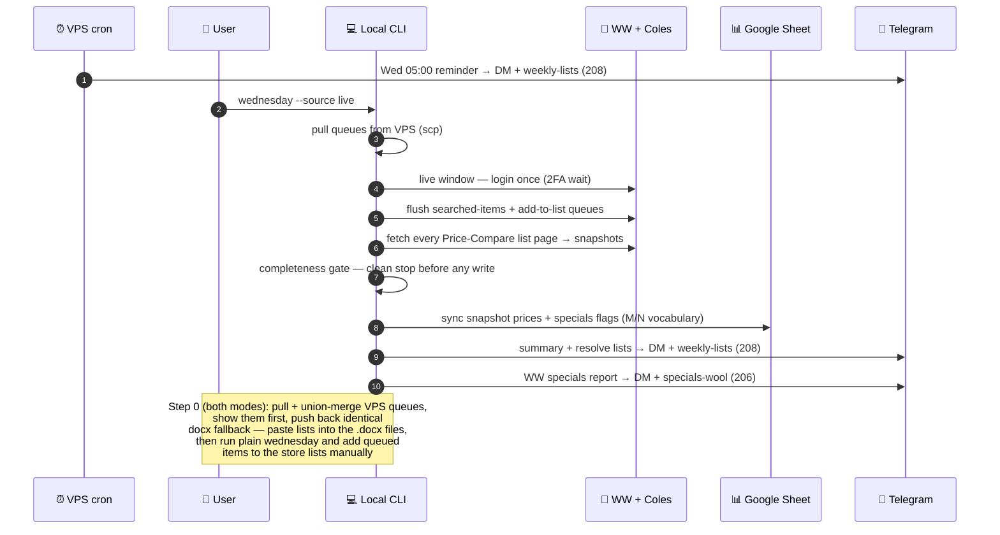

# AI Development Environment — Project README

> **This folder (`grocery-price-tracker/`) is the ultimate canonical root for the entire project.** All project code should live here going forward. Any code currently living outside this folder (in the parent `AI related/` directory) is documented in [Code Currently Outside This Folder (Pending Migration)](#code-currently-outside-this-folder-pending-migration) and will be migrated into this folder later.

A unified, personal AI development environment built around **OpenClaw** ("Claw") — a Telegram-native AI assistant running on a VPS. Claw orchestrates a collection of Python tools (grocery price tracking, expense analysis, LLM pricing, web scraping, image generation, and more) that are exposed as OpenClaw *skills* and invoked conversationally via Telegram, the web UI, or the CLI.

The local machine (Windows + Anaconda) is the development workspace; the VPS (Docker) is the production runtime.

---

## Table of Contents

1. [What's Inside This Folder](#whats-inside-this-folder)
2. [Architecture at a Glance](#architecture-at-a-glance)
3. [Environments — Local, VPS, GitHub](#environments--local-vps-github)
4. [The OpenClaw Runtime (VPS)](#the-openclaw-runtime-vps)
5. [Grocery Price Tracker (flagship tool)](#grocery-price-tracker-flagship-tool)
6. [Telegram Gateway](#telegram-gateway)
7. [Claw Skills](#claw-skills)
8. [Other Tools](#other-tools)
9. [Code Currently Outside This Folder (Pending Migration)](#code-currently-outside-this-folder-pending-migration)
10. [Secrets & Environment Variables](#secrets--environment-variables)
11. [Common Workflows](#common-workflows)
12. [Quick Commands](#quick-commands)
13. [Project Conventions](#project-conventions)

---

## What's Inside This Folder

```
grocery-price-tracker/                      ← ULTIMATE PROJECT ROOT (this folder)
├── README.md                              ← this file
├── PROJECT-MAP.md                         ← plain-language map of every list/command/flow (update with every change)
├── architecture-spec.md                   ← architecture spec
├── implementation-plan.md                 ← implementation plan (§7 = test matrices)
├── test.md                                ← test execution log (every round)
├── __init__.py                            ← package marker
├── app.py                                 ← Streamlit app (legacy UI, mostly superseded by headless CLI)
├── local_sync.py                           ← legacy rapidfuzz-based sync (superseded by lookup engine)
├── name_importer.py                        ← saved-list name import helper
├── Woolworths_Historical.py                ← historical Woolworths price export
├── requirements.txt                        ← Python deps (gspread, google-auth, python-docx, curl_cffi, etc.)
├── runtime.txt                             ← runtime version pin
├── packages.txt                            ← system packages
├── LICENSE
├── .gitignore
├── .git/                                   ← nested git repo (Phase 9 work)
├── .pytest_cache/  .streamlit/             ← caches (gitignored)
│
├── core/                                   ← core library (lookup, sheets, comparator)
├── extractors/                             ← Woolworths/Coles/Aldi live extractors + doc parser
├── components/                             ← (reserved, currently empty)
├── data/                                   ← runtime state (unmatched lists, progress, queues)
├── tests/                                  ← 500+ tests (lookup, live search, sync, comparator, cli, uom, queues, live window)
│
├── Aldi.docx  Coles.docx  Woolworths.docx ← saved-list source files (pasted by user, parsed by doc_parser)
├── Woolworths_Specials.docx                ← specials source file
├── woolworths_master_comparison.csv        ← master comparison export
├── credentials.json                        ← local Google service-account (gitignored; VPS uses env var)
├── prompt to add woolworths savings button.txt
└── Telegram Commands.txt
```

---

## Architecture at a Glance

```
┌──────────────────────────────────────────────────────────────────┐
│  USER                                                             │
│  Telegram app ──── DMs @ClawArkindBot (chat 1594431983)            │
│                   Web UI (https://169-58-107-0.sslip.io)          │
│                   CLI (openclaw agent / openclaw message)         │
└──────────────────────────┬───────────────────────────────────────┘
                           │ Telegram long-poll (getUpdates)
                           ▼
┌──────────────────────────────────────────────────────────────────┐
│  VPS  169.58.107.0  (Ubuntu)   SSH alias: myvps                   │
│  ┌─────────────────────────────────────────────────────────────┐ │
│  │  Docker container: openclaw-core  (image openclaw-core:sketch)│ │
│  │  OpenClaw gateway 2026.6.34  (Node, /app/openclaw.mjs)       │ │
│  │   ├─ Telegram channel (@ClawArkindBot)                      │ │
│  │   ├─ Agent model: openrouter/qwen/qwen3.7-flash             │ │
│  │   ├─ Control API: port 18789 (in-container)                 │ │
│  │   └─ Skills loaded from /app/tasks/ai-tools/claw-skills/   │ │
│  │       (bind-mount ← /home/ubuntu/openclaw/tasks/ai-tools/)  │ │
│  └─────────────────────────────────────────────────────────────┘ │
│  ┌─────────────────────────────────────────────────────────────┐ │
│  │  Docker: ai-studio-app (Next.js) + ai-studio-db (Postgres 16)│ │
│  └─────────────────────────────────────────────────────────────┘ │
│  /home/ubuntu/scripts/wednesday_reminder.py  (cron, every 5 min) │
└──────────────────────────┬───────────────────────────────────────┘
                           │ scp / tar sync (NOT git pull — branches diverged)
                           ▼
┌──────────────────────────────────────────────────────────────────┐
│  LOCAL  Windows + Anaconda Python                                 │
│  C:\Users\User.DESKTOP-R2G441H\Documents\AI related\             │
│   └── grocery-price-tracker\   ← THIS FOLDER (ultimate root)     │
│       (parent "AI related" also holds sibling tools — see below)  │
└──────────────────────────┬───────────────────────────────────────┘
                           │ git push
                           ▼
┌──────────────────────────────────────────────────────────────────┐
│  GITHUB  arkind13/AI-Development-Environment  (private)         │
│  main = local dev HEAD.  master = VPS HEAD (diverged).           │
└──────────────────────────────────────────────────────────────────┘
```

### How everything works — visual map (2026-08-31)

The same architecture, rendered. Colors: blue = VPS, amber = local
machine, green = Telegram topics, purple = cloud (sheet/GitHub),
red = the protected store sites.

```mermaid
flowchart TB
    USER["👤 User<br/>Telegram DM · Web UI · openclaw CLI"]

    subgraph TG["💬 Telegram — Claw Command Center (supergroup)"]
        direction TB
        DM["📩 User DM<br/>summaries · reminders · specials"]
        WEEKLY["📋 weekly-lists — 208<br/>Wednesday summary + resolve lists"]
        SPECIALS["🏷️ specials-wool — 206<br/>Woolworths specials report"]
        RETIRED["🚫 151 grocery-sync-sheet<br/>RETIRED — nothing posts here"]
    end

    subgraph VPS["🖥️ VPS 169.58.107.0 — docker: openclaw-core"]
        CLAW["🤖 Claw agent (OpenClaw)<br/>grocery-price skill — ALL WW/Coles<br/>price questions route to the CLI (B5)"]
        GW["📨 telegram_gateway<br/>handlers · topics · allowlist"]
        CRON["⏰ wednesday_reminder.py<br/>cron — Wed 05:00 Sydney"]
    end

    subgraph LOCAL["💻 Local Windows machine (Anaconda) — pipeline runs here"]
        CLI["🛒 grocery_price_cli.py<br/>compare · search · recipe · specials · map<br/>sync · wednesday · live-refresh · topics-check"]
        subgraph CORE["core/ — brain"]
            LOOKUP["lookup.py<br/>exact → alias → partial → live"]
            UOM["uom.py — 20% size gate<br/>(no per-unit prices, ever)"]
            COMP["price_comparator.py<br/>provenance lines · found-blocks · 🏆"]
            SYNC["sheets_sync.py<br/>batch · update_single_price<br/>add_product_row"]
            DISC["woolworths_discounts.py<br/>5% + home-brand 5%<br/>(display-only)"]
            QUEUES["searched_items.py · add_to_list.py<br/>3-letter codes · 7-day tombstones"]
        end
        subgraph EXT["extractors/ — muscle"]
            WWX["woolworths_extractor<br/>curl_cffi Chrome-131<br/>impersonation"]
            COLES["coles_extractor<br/>Scrape.do + credit guard<br/>retries 5xx/timeout ONLY (B4)"]
            WIN["session_refresh — live window<br/>real Chrome · login · flush · snapshots<br/>discovery capture · per-store isolation"]
            LLF["live_list_fetch<br/>snapshot loader + completeness gate"]
            DOCP["doc_parser · specials_parser<br/>.docx lists · Was $X · Any-N · SPECIAL"]
        end
        DATA["🗂️ data/ — runtime state<br/>searched_items · add_to_list<br/>live_snapshots/ · scrapedo_health"]
    end

    SHEET["📊 Google Sheet — master price DB<br/>A name · D/E/F prices (multi-buy = deal rate) · I/J/K keywords<br/>M/N no · discount · multi-buy · O rewards · P aliases"]
    STORES["🏬 woolworths.com.au · coles.com.au<br/>Akamai/Incapsula protected"]
    GH["🐙 GitHub — arkind13/AI-Development-Environment"]

    USER -->|"asks in chat"| CLAW
    CLAW -->|"skill → CLI commands<br/>(sheet mode, in container)"| CLI
    CRON -->|"Wed reminder"| DM
    CRON -->|"reminder copy"| WEEKLY
    GW -->|"done ack"| WEEKLY
    CLI -->|"compare / search /<br/>recipe answers"| DM
    CLI -->|"summary + resolve lists<br/>(chunked ≤ 4000 chars)"| WEEKLY
    CLI -->|"specials report"| SPECIALS
    CLI --> LOOKUP
    CLI --> SYNC
    CLI --> QUEUES
    LOOKUP --> UOM
    LOOKUP --> COMP
    DISC --> COMP
    SYNC <-->|"read + write"| SHEET
    CLI -->|"live search"| WWX
    CLI -->|"live search"| COLES
    CLI -->|"--source live"| WIN
    WIN -->|"per-page snapshots"| DATA
    LLF <--> DATA
    DOCP -->|"docx mode"| SYNC
    QUEUES -->|"drained by flush"| WIN
    WWX -->|"HTTPS APIs"| STORES
    COLES -->|"via Scrape.do proxy"| STORES
    WIN -->|"logged-in real Chrome"| STORES
    DATA <-->|"scp — queue pull / list push"| VPS
    LOCAL -.->|"git push"| GH

    classDef vps fill:#e8f0fe,stroke:#1a73e8,color:#202124
    classDef local fill:#fef7e0,stroke:#f9ab00,color:#202124
    classDef tg fill:#e6f4ea,stroke:#34a853,color:#202124
    classDef cloud fill:#f3e8fd,stroke:#a142f4,color:#202124
    classDef store fill:#fce8e6,stroke:#d93025,color:#202124
    class CLAW,GW,CRON vps
    class CLI,LOOKUP,UOM,COMP,SYNC,DISC,QUEUES,WWX,COLES,WIN,LLF,DOCP,DATA local
    class DM,WEEKLY,SPECIALS,RETIRED tg
    class SHEET,GH cloud
    class STORES store
```



And the Wednesday rhythm — the weekly loop that produces everything above:



---

## Environments — Local, VPS, GitHub

### 1. Local Windows Machine (Development)

**Parent dir:** `C:\Users\User.DESKTOP-R2G441H\Documents\AI related\`
**This folder (ultimate root):** `...\AI related\grocery-price-tracker\`

Anaconda Python (`anaconda3\python.exe`) is the default interpreter. The local `.env` (in the parent dir) holds all secrets and is gitignored — never committed.

> **Note on layout:** The parent `AI related\` directory currently mirrors the VPS `tasks/ai-tools/` layout (the CLI entrypoint `grocery_price_cli.py`, `claw-skills/`, `telegram_gateway/`, and all sibling tools live as siblings of this folder). The plan is to migrate all of those into this `grocery-price-tracker/` folder so it becomes the single root. See [Code Currently Outside This Folder](#code-currently-outside-this-folder-pending-migration).

### 2. VPS (Production Runtime)

**Host:** `ubuntu@169.58.107.0` (SSH alias: `myvps`)
**Root:** `/home/ubuntu/openclaw/`

The VPS runs the OpenClaw gateway inside a Docker container (`openclaw-core`). The container's `/app/tasks` is a **live bind-mount** of the host's `/home/ubuntu/openclaw/tasks/ai-tools/` — so any file synced to the host repo is immediately visible inside the container (no rebuild needed, survives container restarts).

```
/home/ubuntu/openclaw/
├── openclaw.json                 — gateway config (providers, telegram, skills, tools)
├── docker-compose.yml             — openclaw-core service definition
├── Dockerfile.claw-render         — render image (Playwright + Chromium)
├── .env  → /home/ubuntu/.env      — secrets symlink (all env vars live here)
├── NEW_GATEWAY_TOKEN.txt          — gateway control-API token
├── pylibs/                        — Python packages (PYTHONPATH=/app/pylibs, Python 3.11)
├── pip-bootstrap/                 — minimal Python 3.12 venv
├── scp_staging/                   — deployment staging artifacts
├── tasks/
│   ├── ai-tools/                  — ← MIRRORS LOCAL "AI related" ROOT
│   │   ├── grocery_price_cli.py
│   │   ├── grocery-price-tracker/   ← THIS FOLDER (on VPS)
│   │   ├── claw-skills/
│   │   ├── telegram_gateway/
│   │   └── (all sibling tools)
│   ├── aistudio/                  — AI Studio task metadata
│   └── diag*.sh                   — diagnostic scripts
└── scripts/  (sibling, NOT in git — scp'd directly)
    ├── wednesday_reminder.py      — cron-fired grocery-sync reminder sender
    ├── .wednesday_reminder_state.json — idempotency state
    └── wednesday_reminder.log     — cron stdout/stderr
```

**Bind mounts (container → host):**

| Container path | Host path | Mode |
|----------------|-----------|------|
| `/app/tasks` | `/home/ubuntu/openclaw/tasks` | rw (live) |
| `/app/openclaw.json` | `/home/ubuntu/openclaw/openclaw.json` | rw |
| `/home/node/.openclaw/openclaw.json` | `/home/ubuntu/openclaw/openclaw.json` | rw |
| `/app/pylibs` | `/home/ubuntu/openclaw/pylibs` | ro |

> **Package installs must go into `pylibs`, never the container layer.**
> Anything `pip install`ed inside the running container is wiped by the
> next `--force-recreate` (this silently broke Woolworths live search on
> 2026-09-01: curl_cffi lived only in the container layer). Durable
> install (matches container Python 3.11, survives recreates):
>
> ```bash
> ssh myvps "docker run --rm -v /home/ubuntu/openclaw/pylibs:/target \
>   python:3.11-slim pip install --no-deps --target /target <pkg>"
> ```
>
> curl_cffi 0.16.1 is installed this way (Woolworths no-auth search).
| `/app/tasks/ai-tools/.env` | `/home/ubuntu/openclaw/.env` | ro |

### 3. GitHub

**Repo:** `arkind13/AI-Development-Environment` (private)
**URL:** `https://github.com/arkind13/AI-Development-Environment.git` (VPS uses `git@github.com:...`)

| Branch | Where | Notes |
|--------|-------|-------|
| `main` | Local working branch | Primary dev branch — Phase 9 work, lookup engine, no-login approach |
| `master` | VPS checkout | Diverged from `main`; has unpushed local commits. The VPS working tree is the source of truth for what the container runs (bind mount reads working tree, not HEAD). |

> **Syncing:** Local has uncommitted working-tree changes. Syncing to VPS is done via `scp`/tar, not `git pull`, because branches diverged. See [Common Workflows](#common-workflows).

---

## The OpenClaw Runtime (VPS)

### Container: `openclaw-core`

- **Image:** `openclaw-core:sketch`
- **Process:** tini → `openclaw` (Node, `/app/openclaw.mjs`) — the gateway
- **Version:** OpenClaw 2026.6.34
- **Gateway mode:** `local`
- **Control API port:** `18789` (in-container, not published to host — reached via `docker exec`)
- **Agent model:** `openrouter/qwen/qwen3.7-flash` (thinking=medium)
- **Telegram bot:** `@ClawArkindBot` (token in env `TELEGRAM_CLAW_BOT`)
- **Allowlisted DM chat:** `1594431983` (owner)
- **Skills dir:** `/app/tasks/ai-tools/claw-skills` (bind-mounted)

### Gateway config (`openclaw.json`)

| Config path | Value |
|-------------|-------|
| `gateway.mode` | `local` |
| `channels.telegram.enabled` | `true` |
| `channels.telegram.botToken` | `${TELEGRAM_CLAW_BOT}` (env reference) |
| `channels.telegram.dmPolicy` | `allowlist` |
| `channels.telegram.allowFrom` | `[1594431983]` |
| `commands.ownerAllowFrom` | `["telegram:1594431983"]` |
| `skills.load.extraDirs` | `["/app/tasks/ai-tools/claw-skills"]` |
| `agents.defaults.model.primary` | `openrouter/qwen/qwen3.7-flash` |

### State (inside container, `/home/node/.openclaw/`)

```
.openclaw/
├── openclaw.json              — effective config (mounted from host)
├── openclaw.json.last-good    — last known-good config snapshot
├── agents/main/sessions/sessions.json  — conversation session store
├── identity/                  — device pairing / identity keys
├── state/                     — gateway runtime state
├── workspace/                 — agent workspace (memory, .git)
├── plugin-skills/             — bundled plugin skills cache
└── telegram/                  — ingress spool (polling buffer)
```

### OpenClaw CLI (run inside container)

```bash
# Run an agent turn via the gateway (the faithful "Telegram test" path):
docker exec openclaw-core node /app/openclaw.mjs agent \
  --channel telegram --to 1594431983 \
  --message "compare green capsicum in woolworths and coles" --deliver

# Other useful subcommands:
docker exec openclaw-core node /app/openclaw.mjs status        # gateway/channel status
docker exec openclaw-core node /app/openclaw.mjs skills list   # loaded skills
docker exec openclaw-core node /app/openclaw.mjs sessions list # conversation sessions
docker exec openclaw-core node /app/openclaw.mjs health        # gateway health
docker logs openclaw-core --tail 50                            # recent logs
```

### Other VPS containers

| Container | Image | Purpose |
|-----------|-------|---------|
| `ai-studio-app` | ai-studio image | Next.js 16 AI Studio web app (chat studio) |
| `ai-studio-db` | postgres:16-alpine | AI Studio database |

---

## Grocery Price Tracker (flagship tool)

The most complex tool. Tracks Australian supermarket prices (Woolworths, Coles, Aldi) by maintaining a Google Sheet of canonical products and periodically syncing live prices.

### Entry point

**`grocery_price_cli.py`** — headless CLI (lives in the parent `AI related\` folder, see [migration section](#code-currently-outside-this-folder-pending-migration)). Subcommands:

| Subcommand | Args | What it does |
|------------|------|--------------|
| `compare` | `--items` (req) `[--mode auto\|sheet\|live]` `[--team-discount]` `[--extra-discount FLOAT]` | Basket comparison; `--mode auto` = sheet-first then live fallback. Both-live items pass the UOM 20% size gate; non-comparable items render as a found-block and are excluded from totals |
| `optimize` | `--items` (req) `[--min-saving FLOAT]` (default 3.00) `[--team-discount\|--no-team-discount]` `[--mode auto\|sheet\|live]` `[--confirm CODES\|all\|none]` | Smart Basket: prices the list from the SHEET first, then classifies the rest — items already queued on the searched/to-do lists are reported as no action needed; items with a close substitute on the sheet use that substitute's price read-only (labelled); only the remaining gaps print as a 🔎 confirmation list (A = Coles missing, B = Woolworths missing, C = no pricing, each with a 3-letter code) — nothing is live-searched or written until you confirm with `optimize --confirm <codes\|all\|none>`. Not-on-sheet codes may carry `+add` to ALSO become a new row + searched-list entry; without `+add` they are compared only. A/B and existing-row codes get the live PRICE written into their existing sheet row. **If that side still has a stale keyword (its price was "N/A \<date\>"), the wrong keyword is CLEARED from the sheet and the correct product goes on the TO-DO list** — so you verify the website shopping list; adding the right item there (and confirming via `add-to-list done`) restores the keyword and the weekly Wednesday refresh. If the side has NO keyword, only the price is written and the item stays flagged on the wool/coles missing list until you resolve it via the normal map flow. The final plan recommends ONE Woolworths trip or a per-item split as numbered buy lists (full product names, (sheet)/(live)/(sub) labels, per-store 💵 subtotals, 💰 total savings). Refuses <5 items (stderr + exit 2, points to `compare`). Savings counted item vs item — Σ per-item price gaps, offsets never cancel; a split needs savings strictly above the threshold; ties and sub-threshold movement default to Woolworths. |
| `search` | `--product` (req) `[--expand]` `[--add-item N]` `[--unit UNIT]` `[--allow-duplicate]` | Pure live search (Woolworths API + Coles Scrape.do recipe); no sheet, never writes. ≤3 ranked results per store (8 with `--expand`); `--add-item N` = explicit add of the Nth result (sheet row with EMPTY keyword col + searched-items queue); `--unit` supplies the unit when the result has none. **One-line rule v2 (2026-09-02):** an add that is the SAME product as an existing row updates that row's price + alias instead of creating a second line, and is NOT queued (already tracked). Same product = matching descriptive words (order/brand-prefix/punctuation-insensitive) regardless of pack wording ("5 pack" vs "70g") or unit family (g vs mL); the ONLY keep-apart reason is the same unit with a different amount beyond the 20% tolerance (200g vs 400g, 1L vs 2L — 33g vs 35g still matches). `--allow-duplicate` is the explicit "2 different products" override |
| `specials` | `[--store woolworths\|coles\|all]` | Active specials (sheet Mode B + Woolworths saved-list Mode A) |
| `rewards` | `[--store ...]` | Reads rewards column (O); prints "not populated" when empty |
| `recipe` | `--name` `--ingredients` | Wraps `compare_basket(mode="auto")` for recipe ingredients |
| `update` | `--product` `--store` `--price` `[--dry-run]` | Writes a single price to the sheet |
| `sync` | `[--force]` `[--dry-run]` | Extract → match → batch sheet write + queue summary. **Overwrite semantics (2026-09-02):** listed items with an unusable price (0/blank) get `unavailable <date>`; mapped rows absent from a provided store list get `N/A <date>` — stale prices never linger. The embedded date anchors no-price week aging and survives marker rewrites until a real price returns; a store whose list wasn't parsed is never marked |
| `specials-scan` | `[--min-savings INT]` `[--store woolworths]` | Tier 2 site-wide scan → Tier 1 saved-list |
| `unmapped` | — | Reads `data/unmapped_queue.json`; offline-safe |
| `map` | `unmatched\|wool\|coles\|status` + flags | One-item-at-a-time list resolution (non-interactive). **2026-09-03:** a full resolution (`--pick/--na/--keyword/--forget`, unmatched exact-link `--add`) also removes the item's line from its work-list `.txt` immediately (header count kept honest; progress index stays aligned) — no more stale mid-week counts |
| `lists` | `[--full]` | **THE 7 USER-FACING LISTS — LIVE counts (2026-09-03; list 7 added 2026-09-05).** Lists 1-3 + 6-7 from one fresh sheet read (Unmatched = debt minus ignored minus keyword-exists; wool/coles missing = keyword cols I/J with `NA` counting as populated); list 4 = the to-do queue (multi-buy items marked `(m)` + legend); list 5 = ignored file (COUNT only — names with `--full`); list 6 = **Missed pricing** (FIXABLE: keyword present + price unusable + not GONE; DELETE-PENDING: both stores unusable, GONE included); list 7 = **Sub-category reviews** — rows carrying the literal `needs review` Col Q marker (the classifier never guessed them; the user decides the label). Missing-list counts annotate `(N pending website adds)` (handshake, not dupes) and `(N also in missed pricing)` for cross-list rows. `--full` prints names with ⏳/⚠ markers. NEVER counts the Wednesday `.txt` snapshots (the root cause of the 2026-09-03 stale-counts incident). Sheet failure → "unavailable" + verbatim error, exit 0 |
| `todo` | `show` / `done --items "1,HUY"` / `gone --items "1,HUY"` | **The ONE website-add queue (2026-09-03).** add-to-list entries only (the searched queue is RETIRED) — Coles then Woolworths, continuous numbering, `[CODE]` per entry. `done` (numbers and/or codes, all-or-nothing) removes entries AND writes the remembered exact store name as the row's store keyword. **`gone`:** the item is verified unavailable at that store — the keyword is LEFT ALONE, the literal `GONE` is written into the store's price cell (D/E), and the entry is removed from the queue (same selection as `done`). **Wednesday Step 3c tallies the queue with the sheet** after the sync and auto-clears entries whose row now carries the keyword — the UPDATED to-do list posts FIRST in Telegram |
| `missed-pricing` | `show` (default) / `gone --items "1,ABC"` / `[--purge]` `[--dry-run]` | List #6 on demand: **GROUPED under WOOLWORTHS / COLES / BOTH STORES headers with a deterministic 3-letter code per entry (2026-09-03)** — FIXABLE rows (keyword present + that store's price unusable, not GONE) under their store header, DELETE-PENDING rows (both stores dead) under BOTH STORES. **`gone` (2026-09-03, same rule as the to-do):** the keyword is LEFT ALONE, the failing store's price cell is stamped GONE, and the item leaves the list; a delete-pending selection is stamped at both stores and its row is DELETED immediately (archived to `data/deleted_rows.json`, source `gone-verdict`). `--purge` deletes ALL delete-pending rows NOW (explicit user action; archived; ledger strikes cleared); `--dry-run` previews the purge. A returning real price clears a GONE cell (item resurrected) |
| `add-to-list` | `show` / `done` | **ALIAS of the `todo` queue (2026-09-03)** — same numbering, same done semantics (always writes the keyword) |
| `searched-items` | — | **RETIRED (2026-09-03)** — the searched queue is gone; any invocation prints the retirement notice + the to-do view. The core module (`core/searched_items.py`) is kept as dormant legacy |
| `no-price` | — | **ALIAS of `missed-pricing` (2026-09-03)** — prints the full report (one-store failures included). The old both-dead-only view is gone |
| `live-refresh` | `[--flush-only]` `[--fetch-only]` `[--recapture]` | **RETIRED (2026-09-02) — SHELVED, not deleted.** Was: LOCAL Windows only (headed Chrome): login → flush queues → fetch lists → snapshots. The store-bot war was lost (~16 h; Akamai + Chrome 136 profile security). Code + tests kept for a future breakthrough; do NOT rebuild the failed approaches — see `lostbattle.md`. The agent never runs this. |
| `wednesday` | `[--source docx]` (live RETIRED 2026-09-02 — refused at dispatch; see `lostbattle.md`) `[--dry-run]` `[--no-scp]` `[--no-telegram]` `[--no-prompt]` | Full pipeline. **STARTS WITH THE TO-DO LIST (2026-09-03 user flow):** Step 0 pulls + union-merges + pushes back the queue, then prints the to-do list — add those items on the store website lists, re-paste the docx lists, type `done` (auto-skips with no TTY / `--no-prompt`). Then: parse lists → **Step 1c auto-heal** links exact sheet names (writing keywords) → match/sync prices → **Step 3b two-strike dead-row auto-delete:** both-dead rows deleted only when a PREVIOUS run saw them dead (`data/delete_candidates.json`; deletions archived to `data/deleted_rows.json`) → **Step 3c TO-DO TALLY:** to-do entries whose sheet row now carries the keyword are cleared, and the UPDATED to-do list prints → resolve lists + scp → Telegram post (to-do FIRST, then unmatched, wool/coles missing, **missed pricing** — GROUPED Woolworths / Coles / Both-stores headers with per-item codes + updated week counts, then forgotten as a COUNT) → specials report → **Step 9** mirrors the queue back to the VPS. **Docx is the ONLY live source** — the live window was retired after the lost store-bot war; the manual website adds during the pause replace the flush |
| `backfill-keywords` | — | Backfill Col P keywords from existing data |
| `backfill-sizes` | `[--dry-run]` | One-time Col C (size) backfill parsed from Col A/I/J names; fills only blank cells, never overwrites |
| `shop` | `--items "a, b, c"` | Shopping-list compare: resolves each item to its sub-category, auto-picks the preferred (P) row, asks ONE question when none is preferred |
| `prefer` | `--code ABC` / `--pick N` | Sets the Preferred (P) row for a sub-category; resumes a pending shop run |
| `subcategories` | — | Lists sub-category labels + live row counts |
| `backfill-subcategories` | `[--dry-run]` | One-time Col Q backfill; classifier-confident labels only, else "needs review"; never overwrites |
| `backfill-codes` | `[--dry-run]` | One-time Col R Item-Code backfill; unique permanent codes; idempotent |

> **Routing rule (critical):** `compare X in/at woolworths and coles` must always route to `compare --items "X"` (sheet-first), NEVER `search` (live-only). The `grocery-price/SKILL.md` enforces this.

> **Smart Basket (B2, 2026-09):** `optimize` is the weekly-shop planner — use it for 5+ item lists. Sheet prices first, then the rest is classified: items already queued on the searched/to-do lists are reported as *no action needed* (Wednesday handles them); items with a close substitute on the sheet use that substitute's price **read-only** (labelled `(sub)` with its full name, never written); the remaining gaps are listed for confirmation (A/B/C groups with codes) before any live search. Confirming A/B and existing-row codes writes only the missing PRICE into the row (the keyword — and the weekly Wednesday refresh — come from resolving it via `map`); not-on-sheet items are compared only unless you reply with `+add` (then new row + searched-list entry). It answers "one trip or split?": when item-vs-item movement (Σ per-item gaps, counted item by item so offsets never cancel) is ≤ the $3 threshold it says one Woolworths shop (with a note at the bottom — Coles prices aren't shown for that trip); above it, exactly which items at which store as numbered buy lists. Close calls (ties, sub-threshold movement) default to Woolworths; if Woolworths can't price everything it says a split is forced. `--min-saving` overrides the threshold.

> **Col C contract (units always visible):** Col C is the unit column; every add path fills it (real size or the literal `unit unavailable`); blank = legacy — displays as ` · ⚠️ unit unavailable` everywhere. `search --add-item` and `map --add` accept `--unit UNIT` for one-shot runs when no unit can be resolved (interactive sessions ask once instead).

> **Weekly add-to-list loop:** a wool/coles `map --add` writes the price AND queues the item on `add_to_list` (remembering the EXACT store name + a 3-letter code). Later, on the store website, add the queued items to your shopping list, then run `add-to-list done` (by number or code) — this clears the reminder AND writes the exact store name as the row's store keyword, so the next Wednesday sync matches + price-syncs the item immediately (2026-09-02).

> **Live lists + no gaps (2026-09-03):** all user-facing counts come from `lists` — one fresh sheet read + live queue files, never the Wednesday `.txt` snapshots. The to-do queue is the ONE reminder queue (the searched queue is RETIRED); every price-without-keyword path leaves a to-do entry, `done` ALWAYS writes the keyword, and the Wednesday tally (Step 3c) clears entries once they are on the sheet. Missed pricing captures every keyword-present price failure (one-store included) with two exits: fix the keyword or the `gone` verdict (keyword kept, price cell GONE); both-dead rows enter the guarded two-strike deletion pipeline. Legacy commands (`add-to-list`, `searched-items`, `no-price`) alias or point to the new views so any instruction set reports the same truth. All state lives in host bind mounts on the VPS — container restarts/recreates change nothing.

> **Explicit-add-only + UOM gate (2026-08):** nothing is ever auto-queued. Plain `compare`/`search`/`expand` never write; the only live→sheet routes are `search --add-item N` and `map unmatched --add` (both leave the store keyword column EMPTY). A live item enters a comparison only via a UOM-passing pair (`core/uom.py`: same measurement family, within 20% size, no per-unit prices ever) or when the other store is unavailable (Woolworths-only answer + one ⚠️ line). Coles search runs through a credit-guard (3-attempt silent retry, 40/call-run cap, 10-min circuit breaker in `data/scrapedo_health.json`).

> **One-line rule (2026-09-02):** every explicit add for a product that is already on the sheet lands on the EXISTING row — the price is updated there and the query is saved as a Col P alias; nothing is queued (already tracked). "Same product" ignores word order, store-brand prefixes, punctuation, and pack wording (`5 pack` vs `70g` are ONE product); the only keep-apart reason is the same unit with a different amount beyond the 20% tolerance (200g vs 400g, 1L vs 2L — 33g vs 35g still matches). `search --allow-duplicate` is the explicit "these are 2 different products" override. Exact-name duplicates are always refused.

### Core library (`core/`)

| File | Purpose |
|------|---------|
| `lookup.py` | **Lookup engine** — query resolution chain: exact sheet match (Col A / store keywords I/J/K) → Col P alias two-pass → partial candidates → live search (ranked per store, UOM-gated pair selection, display-only). `LookupIndex` builds `_exact` and `_alias_exact` indices; `LookupEngine` orchestrates the chain; `rank_live_results` / `select_live_pair` implement the tolerant ranking + 20% size gate. |
| `uom.py` | **Unit-of-measure gate** — parses package sizes (25L → 25000 mL, multipacks to totals), compares within families only, 20% tolerance band. Pure stdlib; the sole gate on both-live comparisons. |
| `sheets_client.py` | Shared headless Google Sheets connection (via `GROCERY_SERVICE_ACCOUNT_JSON` + `GROCERY_SPREADSHEET_ID` env vars) |
| `sheets_sync.py` | Batch sync (overwrite semantics: listed-but-priceless → `unavailable <date>`, mapped-but-absent → `N/A <date>`, anchor dates preserved, store-not-provided immunity), `update_single_price`, `add_product_row` (exact-dup guard + one-line-rule merge + `_append_alias`), range-width-aware row writes |
| `price_comparator.py` | Dual-mode basket comparator; in `auto` mode uses the lookup engine via `_gather_lookup_prices()`. Every store line carries identity + provenance (`— name size (sheet|live)`); non-comparable items render the found-block and are excluded from totals |
| `searched_items.py` | Queue-2 (explicit Wednesday adds): 3-letter codes (A–Z minus I/O, no repeated letter), dup-guarded adds, all-or-nothing code removal, 7-day code tombstones, `drain_from_parsed` (Step 1b auto-clear). Mirror of `add_to_list.py` |
| `queue_sync.py` | Wednesday Step 0 queue convergence local↔VPS: union merge by (store, normalised name), earliest added_at wins, blank-field backfill, code-collision regeneration, tombstone union (Claw-side removals never resurrect), atomic JSON IO |
| `name_matcher.py` | Exact keyword matcher for the sync path (Col I/J/K) + duplicate-detection helpers (`similarity_tokens`, `token_set_ratio`, `split_name_size`, `is_same_product` — the one-line-rule engine) |
| `recipe_resolver.py` | Sheet exact → partial → live search resolver for recipe ingredients |
| `specials_reporter.py` | Reads specials/rewards columns from the sheet |
| `missing_items_tracker.py` | Cross-store missing-items diff |
| `woolworths_discounts.py` | Always-on 5% Woolworths display discount + extra 5% home-brand engine; 32-brand home-brand list; monthly extra-discount tracker |
| `schema_upgrade.py` | Idempotent column audit (adds columns M/N/O/P if missing) |
| `list_names.py` | Pinned saved-list name constants |
| `env_probe.py` | Env var verification |
| `auth0_*.py`, `curl_cffi_*.py`, `scrapedo_*.py`, `scraping_login.py`, `stealth_login_test.py` | Auth/login experiments (Playwright, Auth0, Scrape.do, curl_cffi impersonation) — mostly legacy/superseded by the no-login approach |
| `check_scrapedo.py`, `check_settings.py`, `diagnose_cookie.py`, `extract_chrome_cookies.py`, `login_attempts.py`, `query_mylists.py`, `scan_*.py`, `test_search_noauth.py`, `trace_oidc.py` | Diagnostic/probe utilities |

### Extractors (`extractors/`)

| File | Purpose |
|------|---------|
| `woolworths_extractor.py` | Woolworths API client: saved lists (`/apis/ui/mylists`), list items, product detail, search (no-login via curl_cffi Chrome 131 impersonation in Phase 9.2) |
| `coles_extractor.py` | Coles client: Scrape.do GET → parse `__NEXT_DATA__` → `pageProps.searchResults.results`; credit-guarded search chain (3-attempt silent retry with fresh sessions, 40-call per-run cap, 10-min circuit breaker, never retries 401/403); `.docx` fallback for saved lists |
| `live_list_fetch.py` | Offline snapshot loader for the Wednesday live path: reads `data/live_snapshots/YYYY-MM-DD_*` files, converts to ProductItems (id dedup, multipage-safe), `validate_complete()` all-or-nothing gate. No network. |
| `session_refresh.py` | Live-window orchestrator (LOCAL only): Phase A login (headed Chrome + persistent profile + 2FA wait) → Phase B throttled queue flush (session-death abort, 3-strike park) → Phase C paginated list fetch (30-page cap) → snapshots. Plus API-discovery capture and the cookie-only heartbeat probe. Playwright imported lazily. |
| `doc_parser.py` | Parses `Woolworths.docx` / `Coles.docx` / `Aldi.docx` / `Woolworths_Specials.docx` into `ProductItem` lists (headless, via python-docx) |
| `session_manager.py` | Coles auth session management |
| `auth_manager.py` | Playwright auto-login auth manager (2FA, compulsory logout) — superseded by no-login approach |
| `hub.py` | Extractor hub/router |
| `models.py` | Shared data models (`ProductItem`, etc.) |
| `probe_supermarkets.py` | Supermarket endpoint probe utility |
| `probe_results.json`, `ww_full_export.json`, `ww_products_export.json` | Probe/export data snapshots |

### Data (`data/`)

Runtime state files (not in git; synced between local↔VPS):

| File | Purpose |
|------|---------|
| `unmatched.txt` / `coles_missing.txt` / `wool_missing.txt` | Items not matched during sync (resolved via `map`) |
| `unmapped_queue.json` | JSON queue for unmapped items |
| `list_action_progress.json` | `map` session progress (resume indices) |
| `ignored_items.txt` | Permanently-excluded junk items (`map --forget`) |
| `add_to_list.json` | Manual website-add queue (fed by wool/coles `map --add`; drained by `add-to-list done`) |
| `searched_items.json` / `searched_item_code_tombstones.json` | Queue-2 (explicit Wednesday adds via `search --add-item` / `map unmatched --add`; drained by the live-window flush or Wednesday Step 1b list-match; removed codes tombstoned 7 days; converged local↔VPS at every Wednesday Step 0) |
| `forget_list.json` / `price_unavailable.json` | Runtime state from parent-repo Plan B modules (forgotten items; price-unavailable tracker) |
| `session_state.json` / `ww_coles_profile/` | **Secrets** — live-window cookies + browser profile (gitignored, never committed, never printed) |
| `live_snapshots/` | `YYYY-MM-DD_<store>_<list>.json` list snapshots written by the live window, read by `wednesday --source live` |
| `live_api_capture.json` | Discovered add-to-list API + pagination shape per store |
| `live_flush_log.json` | Per-item flush results (status/reason/attempts; rotated at ~1 MB) |
| `scrapedo_health.json` | Scrape.do circuit-breaker state |
| `session_heartbeat.log` | Cookie-only liveness probe log (alive/dead/unknown) |
| `sheets_manager.py` | Sheet-state management helper |
| `phase9_defect_log.json` | Phase 9 defect tracking |
| `woolworths_discount_usage.json` | Discount usage tracking |
| `diagnostics/` | Diagnostic snapshots |

### Tests (`tests/`)

| File | Scenarios |
|------|-----------|
| `test_lookup.py` | 19 GROUP A lookup state-machine scenarios |
| `test_lookup_uom.py` | 19 UOM-gate Step-5 tests: ranking, pair selection, single-store/unavailable routing, Steps 1–4 golden regression |
| `test_uom.py` | 24 size-parse + comparability gate tests |
| `test_searched_items.py` | 40 Queue-2 tests: codes, tombstones, atomic IO, render, Wednesday Step-1b drain (auto-clear of items found on the store lists) |
| `test_queue_sync.py` | 17 queue-convergence tests: union merge (local↔VPS), earliest-added_at identity, field backfill, code-collision regeneration, tombstone union + removal-not-resurrected, file IO |
| `test_coles_recipe.py` | 24 Scrape.do credit-guard tests: params, retry chain, breaker, cap, probes |
| `test_live_window.py` | 48 live-window tests: snapshot loader (F), flush engine + pagination + heartbeat (W) |
| `test_live_search.py` | 13 GROUP B Woolworths+Coles mocked integration tests |
| `test_sheets_sync.py` | 77 tests: `add_product_row` (incl. `Home` Col G marker), `mark_not_available`, `set_store_keyword`, Col I/J/K, duplicate guard, one-line-rule merge (pack-vs-weight, 33g/35g tolerance), sync overwrite semantics (`N/A`/`unavailable` markers, anchor preservation, store-not-provided immunity) |
| `test_name_matcher.py` | 25 Col P two-pass lookup tests |
| `test_comparator.py` | 53 live-search + always-on discount comparison + UOM report tests |
| `test_cli.py` | 122 search/map/compare/discount-surface/backfill/live-routing tests + no-price helpers (price-less cell detection, week buckets, categorized report lines) |
| `test_woolworths_discounts.py` | 30 always-on WW discount tests: 32-brand detection, compounding math, engine, tracker guard |
| `test_extractors.py` | 31 extractor unit tests |
| `test_add_to_list.py` | 22 manual website-add queue tests (module + CLI + size contract) |
| `test_specials_flags.py` | 25 specials vocabulary/flag write tests (D25) |
| `test_telegram_format.py` | 32 Telegram Style Kit tests |
| `test_sheets_conn.py` | offline sheets-connection smoke file (0 collected; network-dependent) |

**Total: 621 tests passing, 0 failed** (2026-09-02: round 1 +20
queue-sync/dup-guard, round 2 +17 one-line-rule/drain, round 3 +13
same-product-v2/no-price, round 4 +16 overwrite-semantics tests —
555 → 621 after the 2026-08-29 repair of the 8 stale Phase-1 failures
and subsequent suite growth. See `test.md` for every round. Testing
runs locally — the VPS/container has no pytest.)

### Google Sheet schema

The tracker reads/writes a Google Sheet (`GROCERY_SPREADSHEET_ID = 16INuFvOUVUY37onpVhdC7_ShLr6bQYg4OGpFPXZT9oM`). Key columns:

| Col | Header | Purpose |
|-----|--------|---------|
| A | Generic Name | Canonical product name (exact-match target) |
| D/E/F | Woolworths/Coles/Aldi price | D/E hold live prices — since 2026-09-05 a multi-buy item's price cell carries the per-unit DEAL rate ("2 for $7.00" on $4.00 → 3.50; "Any 2" deals count too), so sheet comparisons show the saving; when the deal ends the next sync writes the normal shelf price again. F stays raw. Since 2026-09-02 D/E can also hold overwrite markers: `N/A YYYY-MM-DD` (mapped row absent from that store's list) or `unavailable YYYY-MM-DD` (listed but no usable price) — the embedded date anchors no-price week aging and survives marker rewrites until a real price returns |
| G | Brand | Brand name; literal `Home` marks Woolworths home-brand rows (drives the extra home-brand discount) |
| I/J/K | Store keywords | Exact-match keywords for sync path (Wool/Coles/Aldi) |
| M/N/O | Specials/rewards flags | Multi-buy cells carry the deal terms (`multi-buy 2/$6.00`, incl. "Any N" deals) |
| P | Keywords | Alias list (delimiter-separated; two-pass lookup target) |
| Q | Sub_Category | Granular cluster (bread, shredded cheese, eggs); "needs review" marker |
| R | Item_Code | Permanent 3-letter row ID, A–Z minus I/L/O, no repeats |
| S | Preferred | "P" flag; at most one per sub-category; set only via prefer |

### Woolworths always-on display discounts

Every Woolworths price **shown to the user** (compare, search, recipe,
specials, specials-scan, rewards, map/lookup prints, Wednesday specials
report) is automatically discounted at display time:

- **5% off every Woolworths price**, plus an **additional 5% off Woolworths
  home-brand items** (compounds to ≈9.75%; discount math in
  `core/woolworths_discounts.py`, history note in
  [`architecture-spec.md`](architecture-spec.md) §"Replaces" — the original
  spec archive `architecture-spec-woolworths-discounts.md` is no longer on
  disk).
- Prices are printed PLAIN (e.g. `$3.61`) — the team discount is never
  shown as a "(was $x)" suffix. A `(was $x)` suffix appears ONLY when the
  store itself reports the item on special with a WasPrice.
- The Google Sheet always stores **raw** prices — discounts are display-only.
- Home-brand detection and the 32-brand list (Apollo, Balnea, … Woolworths)
  live in `core/woolworths_discounts.py`. The sheet's Col G `Home` marker is
  also recognised.
- When new rows are added (`add_product_row`), a home-brand item's Brand cell
  (Col G) is written as `Home` automatically. `backfill-home-brands` can
  normalise existing rows.
- Coles/Aldi prices are never discounted. The monthly `--extra-discount`
  flag is a separate, unchanged mechanism.

### Woolworths team discount — ONE-LINE on/off switch

The entire team discount is controlled by a single constant at the top of
`core/woolworths_discounts.py`:

```python
TEAM_DISCOUNT_ENABLED = True   # False = show original raw Woolworths prices
```

| Value | Behaviour |
|-------|-----------|
| `True` (default) | All WW prices **displayed** with the team discount (5% + 5% home-brand extra). |
| `False` | EVERY surface automatically reverts to the **original raw Woolworths price** — compare, search, recipe, specials, specials-scan, rewards, map/lookup, the Wednesday report, and cheapest-store math. No other code changes needed. |

Example for the same item (home-brand fetta, sheet price $4.00):

```
TEAM_DISCOUNT_ENABLED = True    🟢 Woolworths  $3.61
TEAM_DISCOUNT_ENABLED = False   🟢 Woolworths  $4.00
```

**How to toggle:**

1. Edit the one line in `grocery-price-tracker/core/woolworths_discounts.py`.
2. Local use: nothing more — every CLI run picks it up immediately.
3. Production (VPS): sync the one file — no Docker restart needed (the CLI
   runs fresh each call and the folder is a live bind-mount):

   ```powershell
   scp core\woolworths_discounts.py myvps:/home/ubuntu/openclaw/tasks/ai-tools/grocery-price-tracker/core/woolworths_discounts.py
   ```

**Per-call override (works regardless of the switch):**
`compare`/`recipe` accept `--team-discount` / `--no-team-discount` to force
discounts on/off for a single call without touching the switch (their
default is to follow `TEAM_DISCOUNT_ENABLED`).

### Multi-buy pricing (2026-09-04, price-cell rule 2026-09-05)

"2 for $6.00" promos carry real per-unit rates, applied everywhere a
price is compared or shown:

- **Price cells hold the deal rate (user rule 2026-09-05):** a
  multi-buy item's D/E price IS the per-unit deal rate — "2 for
  $7.00" on a $4.00 item writes 3.50 — so the saving is evident in
  every sheet comparison. The bundle terms stay the source of truth
  in the specials cell; when the deal ends the next sync overwrites
  the price normally.
- **Rate math:** `rate = bundle total / qty` (`core/multibuy.py`):
  2 for $6.00 → $3.00 per unit. Totals, cheapest-store math, and WW
  display discounts all compute from the effective rate (§7.3).
- **Mandatory note:** whenever a displayed price is multi-buy-derived,
  the tag `🏷️ 2 for $6.00  [Note: must purchase 2+ units to receive
  this price]` and a totals footnote are shown.
- **Sheet cells (M/N):** ALL multi-buy promos are stored WITH terms
  as `multi-buy 2/$6.00`; the bare legacy `multi-buy` marker is
  refreshed by the next sync that sees the item.
- **"Any N | $X" deals count (user rule 2026-09-05, D-MB3 retired):**
  in-store they mean any N units from the same range/brand, so they
  are rate-eligible multi-buy prices exactly like "N for $X".
- **List marks:** to-do/list views mark deal items with `(m)` and a
  bottom legend `(m) - multi buy discount` (no per-item clutter).
- **Live degradation (D-MB2):** when a store payload carries no
  multi-buy data (or, for Woolworths, the keys are unverified), live
  paths fall back to normal pricing; the docx/sheet paths carry
  multi-buy alone. Promo fields are never invented.

### Sub-categories: never guess (user rule 2026-09-05)

New products are classified against the taxonomy
(`core/subcategory.py`, word-boundary safe — "V Sugarfree" is not
sugar, "V Watermelon" is not water, "eggplant" is not eggs). When no
rule matches confidently, the row's Col Q gets the literal
`needs review` marker and the item surfaces on the **Sub-category
reviews** list (list 7 in `lists`, plus the weekly Telegram post) —
the agent asks the user for the right label; nothing is ever guessed.

### Shopping list & preferences (2026-09-04)

`shop --items "eggs, apples, bread"` compares a whole shopping list
against your stored preferences — full flow in
[PROJECT-MAP.md](PROJECT-MAP.md) §6F. The preference state machine:

- **S4 — preferred known:** the sub-category's Preferred (P) row is
  compared automatically.
- **S1 — no preference yet:** the CLI asks ONE numbered question
  (full names + 3-letter codes) and saves a pending run.
- **S0 — not tracked:** you get a keyword suggestion for the normal
  `search --add-item` flow instead.
- **S5 — specific variant requested:** you get the comparison plus a
  switch/keep warning; "keep" writes nothing.
- **S3 — answer:** `prefer --code ABC` (or `--pick N`) sets P and
  finishes the halted run (24h window).

`prefer` is the ONLY writer of the Preferred column — ingestion never
auto-sets P, and the Wednesday sync never touches it. Note:
`Item_Code` (Col R) is a DIFFERENT namespace from the to-do queue
codes — `prefer ABC` and `todo done ABC` never collide.

### Live APIs used

**Woolworths** (no login required in Phase 9.2):
- Lists: `GET /apis/ui/mylists`
- List items: `GET /apis/ui/mylists/{id}`
- Product detail: `GET /apis/ui/product/detail/{ArticleId}`
- Search: `GET /apis/ui/Search/products?searchTerm=X` (curl_cffi Chrome 131 impersonation)
- Key fields: `DisplayName`, `Price`, `IsOnSpecial`, `WasPrice`, `Brand`, `PackageSize`, `CupString`

**Coles** (Scrape.do bypass for Incapsula WAF):
- Search: Scrape.do GET search page → parse `__NEXT_DATA__` → `pageProps.searchResults.results`
- List: `Coles.docx` fallback (python-docx)
- Key fields: `name`, `brand`, `size`, `pricing.now`, `pricing.was`, `pricing.onlineSpecial`

**Aldi:** No live extractor — Aldi prices are sheet-only (`—` in compare tables).

---

## Telegram Gateway

**`telegram_gateway/`** — a Python Telegram bot framework (separate from the OpenClaw gateway). Lives in the parent folder (pending migration). Provides budget-sheets integration, command review, and the Wednesday grocery-sync reminder cron.

| File | Purpose |
|------|---------|
| `bot.py` | Bot initialization and main loop |
| `handlers.py` | Message handlers (incl. `handle_done` for the Wednesday reminder `done` reply) |
| `commands.py` | Command definitions/routing |
| `budget_sheets.py` | Budget Google Sheet tool (deployed as Claw `budget-sheets` skill) |
| `allowlist.py` | Allowed-user enforcement |
| `topics.py` | Telegram forum-topic routing (Claw Command Center supergroup) |
| `runner.py` | Bot runner entrypoint |
| `wednesday_reminder.py` | One-shot Wednesday grocery-sync reminder sender (deployed to `/home/ubuntu/scripts/` on VPS, cron every 5 min) |
| `health_check.py` | Bot health check |
| `command_review_registry.md` | Command review documentation |
| `.env.example` | Environment template |

### Wednesday Reminder (VPS cron)

Deployed outside the git tree (`/home/ubuntu/scripts/`) to avoid git-pull clobbering:

- **Cron:** `*/5 * * * * /usr/bin/python3 /home/ubuntu/scripts/wednesday_reminder.py >> .../wednesday_reminder.log 2>&1`
- **Self-gating:** Sydney time Wed 05:00–05:30 AEST/AEDT (DST-correct via `zoneinfo`; VPS host tz is Europe/Berlin but doesn't affect delivery)
- **Delivery:** user DM + `weekly-lists` topic (thread 208 in the Claw
  Command Center supergroup; the old `grocery-sync-sheet` topic 151 is
  RETIRED — D24, nothing posts to it)
- **Test:** `ssh myvps 'python3 /home/ubuntu/scripts/wednesday_reminder.py --test'`
- **Status:** `... --status` (prints Sydney now, last sent, next fire)

---

## Claw Skills

Each tool has a `SKILL.md` that tells the OpenClaw agent how to invoke it. The skills directory (`claw-skills/`) lives in the parent folder (pending migration) and is bind-mounted into the container at `/app/tasks/ai-tools/claw-skills/`.

| Skill | SKILL.md | Description |
|-------|----------|-------------|
| `grocery-price` | `grocery-price/SKILL.md` | Supermarket prices, basket compare, specials, sync, resolve |
| `budget-sheets` | `budget-sheets/SKILL.md` | Budget Google Sheet updates (balance, allowance, pay) |
| `claude-pricing` | `claude-pricing/SKILL.md` | Claude model pricing |
| `gpt-pricing` | `gpt-pricing/SKILL.md` | GPT model pricing |
| `video-pricing` | `video-pricing/SKILL.md` | Video model pricing |
| `discounts` | `discounts/SKILL.md` | OpenRouter discounted/promo models |
| `free-models` | `free-models/SKILL.md` | Free-tier models on OpenRouter |
| `daily-digest` | `daily-digest/SKILL.md` | New AI model releases in last 24h |
| `openrouter-usage` | `openrouter-usage/SKILL.md` | OpenRouter spend history |
| `expenses-summary` | `expenses-summary/SKILL.md` | Expense totals + category breakdown |
| `expenses-view` | `expenses-view/SKILL.md` | Detailed expense view |
| `image-studio` | `image-studio/SKILL.md` | Image generation (Flux / Seedream) |
| `sketchnote` | `sketchnote/SKILL.md` | YouTube → sketchnote images |
| `web-scrape` | `web-scrape/SKILL.md` | Web page scraping (ZenRows → Scrape.do) |

The `grocery-price/SKILL.md` is the most detailed skill file — it defines subcommand→intent mappings, the NL routing table, multi-turn conversation flows (resolve sessions), degradation rules, and hard rules for the agent.

### Telegram message formatting (all skills)

All Claw skill output shown on Telegram uses the shared **Telegram Style Kit** (`core/telegram_format.py`): no markdown tables (they break in Telegram), list-style item blocks, fenced monospace totals, unicode dividers, and a shared icon vocabulary. SKILL.md files instruct the agent to relay CLI output verbatim. Spec: [`architecture-spec-telegram-formatting.md`](architecture-spec-telegram-formatting.md).

The kit is stdlib-only and imports nothing from siblings. Key API:

- `header(title, icon)` / `subheader(title, icon=None)` — CAPS title + heavy `━`×20 / light `─`×10 divider.
- `item_block(index, name, prices, home_brand=False)` / `store_line(store, price, was=None)` — list-style items with 🟢/🔴 aligned price lines.
- `fenced_table(headers, rows, box=False)` — padded ```-fenced table, equal-width lines, ≤ `MAX_BLOCK_WIDTH` (34) cells.
- `money(n)` / `kv(l, v)` / `tail(w, s, vs)` / `warn` / `ok` / `fail` / `footer(ts)` / `truncate(s, width)`.

Example:

```python
from core.telegram_format import header, fenced_table

print(header("Basket Comparison", "🛒"))
print(fenced_table(
    ["Store", "Raw", "Final"],
    [["Woolworths", "$23.40", "$21.75"], ["Coles", "$24.10", "$24.10"]],
    box=True,
))
```

Width budgets: `MAX_NAME_WIDTH = 60` — full product names everywhere;
fenced tables stay 34 cells (`MAX_BLOCK_WIDTH = 34`, phone-fit). Emoji
count as 2 cells (`_cells()`).

---

## Other Tools

### Daily Models Digest (`daily-models-digest/`)
- `daily_digest.py` — scans OpenRouter for model releases in the last 24h, posts a digest. GitHub Actions workflow (`.github/workflows/daily_models.yml`).

### OpenRouter Model Costs (`openrouter model costs/`)
- `claude_pricing.py`, `gpt_pricing.py`, `Openroutervideo.py`, `free_api.py`, `cheapest_models.py`, `Discount_github.py` — per-token pricing, release dates, discounts, free models, cheapest models.

### OpenRouter Usage (`openrouter_usage/`)
- `Code_for_usage.py` — fetches OpenRouter usage, builds `OpenRouter_Usage_Summary.xlsx`. Stores historical CSV snapshots.

### Credit Card Tracking (`Credit_Card_Tracking/`)
- `category.py` — categorizes credit-card expenses, builds monthly summaries (`expense_summary.xlsx`).
- `visualize_expenses.py` — expense visualization.
- `expense_summary_wool.py` — Woolworths-specific expense summary.

### Scraping API (`scraping_api/`)
- `scrape.py` — shared web-fetch helper. ZenRows primary, Scrape.do fallback. Used by other tools.

### Image Generator (`Image Generator Code/`)
- `image_studio.py`, `app.py` — image generation via Flux 2 / Seedream 5 APIs.

### Sketchnote Generator (`Sketchnotes_ytube_video/`)
- `sketchnote_generator.py` — generates sketchnote images from YouTube videos.

### AI Studio (`ai-studio/`)
- Next.js 16 App Router app — a ChatGPT-like chat studio. Deployed as `ai-studio-app` container + `ai-studio-db` (Postgres). Specs in `MASTER_BUILD_SPEC.md`.

### My Budget Tracker (`my-budget-tracker/`)
- Streamlit personal budget app (git submodule, not deployed to Claw).

---

## Code Currently Outside This Folder (Pending Migration)

> The following code currently lives in the parent directory `C:\Users\User.DESKTOP-R2G441H\Documents\AI related\` (and mirrors VPS `/home/ubuntu/openclaw/tasks/ai-tools/`). The plan is to migrate all of these into this `grocery-price-tracker/` folder so it becomes the single ultimate root. On the VPS, the corresponding paths are under `/home/ubuntu/openclaw/tasks/ai-tools/`.

| Item (in parent dir) | VPS path | Type | Purpose | Migration priority |
|----------------------|----------|------|---------|--------------------|
| `grocery_price_cli.py` | `tasks/ai-tools/grocery_price_cli.py` | Python CLI | **Main entrypoint** for the grocery tracker (headless CLI with all subcommands) | **HIGH** — should move into this folder |
| `discounts_cli.py` | `tasks/ai-tools/discounts_cli.py` | Python CLI | Discounts CLI helper | Medium |
| `create_env.py` | `tasks/ai-tools/create_env.py` | Python script | `.env` generation helper | Low |
| `claw-skills/` | `tasks/ai-tools/claw-skills/` | Skill defs (14 `SKILL.md`) | OpenClaw skill definitions — `grocery-price/`, `budget-sheets/`, `claude-pricing/`, `gpt-pricing/`, `video-pricing/`, `discounts/`, `free-models/`, `daily-digest/`, `openrouter-usage/`, `expenses-summary/`, `expenses-view/`, `image-studio/`, `sketchnote/`, `web-scrape/` | **HIGH** — `grocery-price/SKILL.md` belongs with this folder |
| `telegram_gateway/` | `tasks/ai-tools/telegram_gateway/` | Python bot framework | Telegram bot: `bot.py`, `handlers.py`, `commands.py`, `budget_sheets.py`, `allowlist.py`, `topics.py`, `runner.py`, `wednesday_reminder.py`, `health_check.py` | Medium |
| `daily-models-digest/` | `tasks/ai-tools/daily-models-digest/` | Python tool | `daily_digest.py` + GitHub Actions workflow | Medium |
| `openrouter model costs/` | `tasks/ai-tools/openrouter model costs/` | Python tools | LLM pricing: `claude_pricing.py`, `gpt_pricing.py`, `Openroutervideo.py`, `free_api.py`, `cheapest_models.py`, `Discount_github.py` | Medium |
| `openrouter_usage/` | `tasks/ai-tools/openrouter_usage/` | Python tool | `Code_for_usage.py` + usage CSVs + summary xlsx | Medium |
| `Credit_Card_Tracking/` | `tasks/ai-tools/Credit_Card_Tracking/` | Python tool | `category.py`, `visualize_expenses.py`, `expense_summary_wool.py` + monthly CSVs | Medium |
| `scraping_api/` | `tasks/ai-tools/scraping_api/` | Python tool | `scrape.py` shared web-fetch helper | Medium |
| `Image Generator Code/` | `tasks/ai-tools/Image Generator Code/` | Python tool | `image_studio.py`, `app.py` (Flux / Seedream) | Low |
| `Sketchnotes_ytube_video/` | `tasks/ai-tools/Sketchnotes_ytube_video/` | Python tool | `sketchnote_generator.py` + sample images | Low |
| `ai-studio/` | `tasks/ai-tools/ai-studio/` | Next.js app | AI Studio specs (`MASTER_BUILD_SPEC.md`, `.tsx` components) — deployed as separate container | Low |
| `my-budget-tracker/` | `tasks/ai-tools/my-budget-tracker/` | Streamlit app | Personal budget app (git submodule, not deployed) | Low |
| `.env` | `tasks/ai-tools/.env` (ro mount) | Secrets | All environment variables — stays in parent (gitignored); do NOT migrate into a tracked folder | N/A (stays outside) |
| `pre.md` | `tasks/ai-tools/pre.md` | Markdown | VPS folder-structure map (canonical reference) | Low |
| `DIRECTORY_TREE.md`, `directory_tree.txt` | `tasks/ai-tools/` | Markdown/txt | Auto-generated directory trees | Low |

### Migration notes
- When migrating `grocery_price_cli.py` into this folder, update all `sys.path`/import bootstrap logic in the CLI (it currently resolves the tracker path relative to its own location) and update the `SKILL.md` run command paths.
- When migrating `claw-skills/grocery-price/SKILL.md`, update the run command paths (currently `cd /app/tasks/ai-tools && python3 grocery_price_cli.py`).
- `.env` must remain gitignored and outside any tracked folder — do not migrate it into this folder.

---

## Secrets & Environment Variables

**All secrets live in `.env`** (parent dir, gitignored). On VPS, `/home/ubuntu/openclaw/.env` is a symlink to `/home/ubuntu/.env`, mounted read-only into the container at `/app/tasks/ai-tools/.env`.

| Env var | Used by | Purpose |
|---------|---------|---------|
| `GOOGLE_SERVICE_ACCOUNT_JSON` | `sheets_client.py` | Google Sheets service-account credentials (JSON) |
| `GROCERY_SERVICE_ACCOUNT_JSON` | `sheets_client.py` | Grocery sheet service-account credentials |
| `GROCERY_SPREADSHEET_ID` | `sheets_client.py` | Google Sheet ID (`16INuFv...`) |
| `WOOLWORTHS_COOKIE` | `woolworths_extractor.py` | Woolworths auth cookie (live list/search) |
| `WOOLWORTHS_USER` / `WOOLWORTHS_PASS` | `auth_manager.py` | Woolworths login creds |
| `COLES_COOKIE` | `session_manager.py` | Coles auth cookie |
| `COLES_USER` / `COLES_PASS` | extractors | Coles login creds |
| `COLES_LIST_URL` | `coles_extractor.py` | Coles saved-list Scrape.do URL |
| `COLES_API_KEY` | `coles_extractor.py` | Coles search headers |
| `SCRAPEDO_API_KEY` | `coles_extractor.py`, `scraping_api/scrape.py` | Scrape.do API key |
| `ZENROWS_API_KEY` | `scraping_api/scrape.py` | ZenRows API key |
| `TELEGRAM_CLAW_BOT` | openclaw.json (`channels.telegram.botToken`) | OpenClaw bot token (@ClawArkindBot) |
| `TELEGRAM_TOKEN` | telegram_gateway | Telegram gateway bot token |
| `TELEGRAM_CHAT_ID` | telegram_gateway | Telegram chat ID for direct messages |
| `OPENROUTER_API_KEY` (+ variants) | openclaw.json, tools | OpenRouter API key(s) |
| `GEMINI_API_KEY` / `GEMINI_KEY_AI_STUDIO` | tools, ai-studio | Google Gemini keys |
| `OPENCLAW_GATEWAY_TOKEN` | gateway control API | Gateway control-API auth token |
| `BYTEPLUS` | tools | BytePlus API key |
| `YOUTUBE_API_KEY` | sketchnote generator | YouTube Data API key |
| `NTFY_TOPIC` | notifications | ntfy.sh push notification topic |
| `SUPABASE_JWT_TOKEN` | ai-studio | AI Studio Supabase JWT |
| `POSTGRES_PASSWORD` | ai-studio-db | Postgres password |
| `MASTER_APP_PASSWORD` | various | Master app password |
| `JWT_SECRET` / `NEXTAUTH_SECRET` | ai-studio | Auth secrets |

> **Security:** `.env` is in `.gitignore` and `.kiloignore`. Never print, log, or echo secret values. Never commit `credentials.json`. Service-account JSON is loaded as an env var, not a file, in production.

---

## Common Workflows

### Edit → test locally → sync to VPS

```powershell
# 1. Edit code locally in this folder (e.g., core/lookup.py)
# 2. Test locally with Anaconda Python:
$env:PYTHONIOENCODING="utf-8"
& "$env:USERPROFILE\anaconda3\python.exe" ..\grocery_price_cli.py compare --items "green capsicum"

# 3. Sync changed files to VPS (scp — branches diverged, so not git pull):
scp core\lookup.py myvps:/home/ubuntu/openclaw/tasks/ai-tools/grocery-price-tracker/core/lookup.py

# 4. Verify md5 matches:
Get-FileHash core\lookup.py -Algorithm MD5
ssh myvps 'md5sum /home/ubuntu/openclaw/tasks/ai-tools/grocery-price-tracker/core/lookup.py'
```

### Bulk sync (tar, excludes data/secrets/cache)

```powershell
# Build archive (excludes data/, .git/, __pycache__, credentials.json):
tar -czf "$env:TEMP\kilo\sync.tar.gz" `
  --exclude="data" `
  --exclude=".git" `
  --exclude="*__pycache__*" `
  --exclude="credentials.json" `
  .

# Upload + extract on VPS:
scp "$env:TEMP\kilo\sync.tar.gz" myvps:/tmp/sync.tar.gz
ssh myvps 'cd /home/ubuntu/openclaw/tasks/ai-tools/grocery-price-tracker && tar -xzf /tmp/sync.tar.gz && rm /tmp/sync.tar.gz'
```

> **PowerShell 5.1 quoting caveat:** PowerShell mangles adjacent quotes (`""`) and nested quotes in `ssh` commands. For any multi-word CLI arg inside the container, **base64-transfer a script file** instead of inline quoting:
> ```powershell
> $b64 = [Convert]::ToBase64String([IO.File]::ReadAllBytes("$env:TEMP\kilo\script.sh"))
> ssh myvps "echo $b64 | base64 -d > /home/ubuntu/openclaw/tasks/ai-tools/.tmp.sh; docker exec openclaw-core bash /app/tasks/ai-tools/.tmp.sh; rm /home/ubuntu/openclaw/tasks/ai-tools/.tmp.sh"
> ```

### Restart the container (reload skills/config)

```bash
ssh myvps 'docker restart openclaw-core; sleep 30; docker ps --format "{{.Names}} {{.Status}}"'
```

### Run the full Telegram test (3 queries)

```bash
# Via the OpenClaw agent CLI (faithful end-to-end path, delivers reply to Telegram):
ssh myvps 'docker exec openclaw-core node /app/openclaw.mjs agent --channel telegram --to 1594431983 --message "compare green capsicum in woolworths and coles" --deliver'
```

### Wednesday grocery-sync pipeline (local)

```powershell
# Run it — it shows the queue FIRST and waits:
& "$env:USERPROFILE\anaconda3\python.exe" ..\grocery_price_cli.py wednesday
```

The docx flow, in order:

1. **Step 0** — pulls the queues from the VPS, union-merges them with the
   local copies (nothing lost on either side), pushes the merged files
   back, and prints the searched + to-do queues.
2. **Pause** (real terminal only) — you add the queued items to the store
   website lists, paste the updated lists into `Woolworths.docx` /
   `Coles.docx` (specials into `Woolworths_Specials.docx`), then type
   `done`. `--no-prompt` skips the wait; non-terminal callers (Claw/CI)
   skip it automatically.
3. **Steps 1–1b** — parses the docx lists, then auto-clears every queued
   item that now appears on its store's list (proof it was added).
4. **Steps 2–3** — matches against the sheet and OVERWRITES every price:
   found → real price; listed-but-priceless → `unavailable <date>`;
   mapped-but-absent → `N/A <date>` (stale prices never linger).
5. **Steps 4–7** — builds the resolve lists, scps them to the VPS, posts
   the summary + **seven lists** to the weekly-lists topic (unmatched,
   wool/coles missing, no-price items with category + weeks, to-do,
   searched, forgotten).
6. **Step 8** — Woolworths specials report → DM + specials-wool topic.
7. **Step 9** — mirrors the queues back to the VPS so consumption and
   removals propagate.

Flags: `--dry-run` (parse+match+report only, no writes), `--no-scp`,
`--no-telegram`, `--no-prompt`, `--source live` (browser window flow —
flush + fetch snapshots instead of the manual pause; completeness-gated).

---

## Quick Commands

```
SSH:              ssh myvps   (= ssh ubuntu@169.58.107.0)
Live AI Studio:    https://169-58-107-0.sslip.io
Telegram bot:      @ClawArkindBot  (chat 1594431983)

Container status:  ssh myvps 'docker ps'
Gateway logs:      ssh myvps 'docker logs openclaw-core --tail 50'
Gateway status:    ssh myvps 'docker exec openclaw-core node /app/openclaw.mjs status'
Skills list:       ssh myvps 'docker exec openclaw-core node /app/openclaw.mjs skills list'

Local Python:      & "$env:USERPROFILE\anaconda3\python.exe" ..\grocery_price_cli.py --help

WW team discount:  ONE-LINE switch — TEAM_DISCOUNT_ENABLED in core/woolworths_discounts.py
                   True = discounted prices (default) / False = raw prices
                   Toggle on VPS: scp core\woolworths_discounts.py myvps:/home/ubuntu/openclaw/tasks/ai-tools/grocery-price-tracker/core/
                   (no Docker restart needed; per-call override: --no-team-discount)

AI Studio (VPS):   cd /home/ubuntu/openclaw/tasks/aistudio/ai-studio && docker compose up -d
                  Rebuild: docker compose build ai-studio-app && docker compose up -d ai-studio-app
                  Logs:    docker logs ai-studio-app
```

---

## Project Conventions

- **Python:** 4-space indent, snake_case, 88-char max line, docstrings on all functions.
- **JS/TS/JSON/YAML:** 2-space indent.
- **Error handling:** Never bare `except: pass`; fail fast; validate inputs.
- **Secrets:** `.env` only — never hardcoded, never logged, never committed.
- **Testing:** TDD where practical; test boundaries (empty, null, invalid types).
- **Dependencies:** Pinned versions; minimize third-party deps.
- **Plain-language map:** [`PROJECT-MAP.md`](PROJECT-MAP.md) documents every list, command, and scenario in simple language. **Update it in the same change whenever a list, command, flag, or flow changes.**
- **Units (Col C):** the sheet's unit/size column is the single unit source. Every product mention in any output shows its unit or an explicit `unit unavailable` note; every add path fills Col C (asks the user when unknown). See `architecture-spec.md` (Units Always Visible).

---

## D23–D27 + B4/B5 completion (2026-08-30)

Completion of the remaining open decisions from the architecture spec.

### D23 — compare add-reminder

`format_report` (core/price_comparator.py) now ends with the same queue
reminder `search` prints — `💬 Reply 'add item N' to queue a result for
Wednesday.` — exactly once, and only when a DISPLAYED item (top 25) shows
a live product: a live-sourced price or a found-block. Sheet-only and
empty reports are unchanged.

### D24 — Wednesday Telegram topic split

Wednesday output no longer posts to the retired `grocery-sync-sheet`
topic (thread 151 — **no code may ever post to it again**):

- summary + resolve lists → `weekly-lists` topic (resolve lists chunked
  at ≤ 4000 chars/part with `(part N/M)` suffixes; empty lists post a
  single `📋 <title>: none`);
- Woolworths specials report → `specials-wool` topic;
- user DMs keep exactly the previous content.

Topic IDs are placeholders (`None`) until manual step M1; env overrides
`TELEGRAM_WEEKLY_TOPIC_ID` / `TELEGRAM_SPECIALS_TOPIC_ID` always win
(A8). With IDs unset, sends fall back to DM-only with a console note —
nothing crashes. The new read-only `topics-check` subcommand lists the
forum topic names → thread IDs visible to the bot (M1 helper, local
machine only). The Wednesday reminder also targets `weekly-lists` with
refreshed instructions.

### D25 — sheet specials vocabulary `no` / `discount` / `multi-buy`

Sheet specials columns M/N now hold exactly one of `no` / `discount` /
`multi-buy` (classifier: `classify_special` in
extractors/specials_parser.py; precedence: `Any N | $X` / `N for $X` →
multi-buy, then `Was $X` / `Save $X` / flag → discount, else `no`).
Coles docx markers `Was $X`, `Any N | $X` (below the price) and a bare
`SPECIAL` flag line (above the name) are parsed by
extractors/doc_parser.py; a below-line marker wins over an above-line
flag, and a bare Save/Was above a product is never attached to it (A7
guard). The specials reporter treats empty/`no` as not-on-special and
still reports legacy free-text cells. All live add paths (`search --add`,
`map --add`, Telegram adds) pass the specials flag/desc through.

### D26/D27 — real discovery recording + loud status

`_LocalDriver.capture_add_to_list` (extractors/session_refresh.py)
records the REAL add-to-list API call: the request listener attaches
before the prompt; the first same-origin non-GET request mentioning a
list wins; its JSON body shape is stored (P4c). Coles additionally
resolves and verifies `lists_url` in page context — an unverified
capture fails discovery instead of saving something broken (P4d).
Discovery is now automatic on a true first run (`live-refresh` prompts
when any store lacks a capture) and `--recapture` genuinely forces
re-training (P4b). Flush is per-store isolated: a missing capture fails
only that store, with a `reason` printed. Both `live-refresh` and the
Wednesday live window print `Discovery: captured` / `Discovery: failed —
run 'live-refresh --recapture' to train` per store, plus any flush
`reason`.

### B4 — Scrape.do retries on 5xx/timeout only

The Coles Scrape.do chain retries ONLY 5xx responses and network
exceptions (fresh session, sleep 3 then 6, exactly 3 attempts). Every
4xx (404, 429, …) fails immediately after ONE attempt — stderr note,
breaker failure recorded, store marked unavailable (Woolworths-only
+ ⚠️ line path). 401/403 keep their dedicated branch.

### B5 — never browse the store sites

SKILL.md hard rule: the agent NEVER uses `web_search`/`web_fetch` (or
any browsing tool) on `woolworths.com.au` / `coles.com.au` — all price,
special, and discount questions for these stores go through the grocery
CLI. Ordinary web search stays allowed for everything else.
